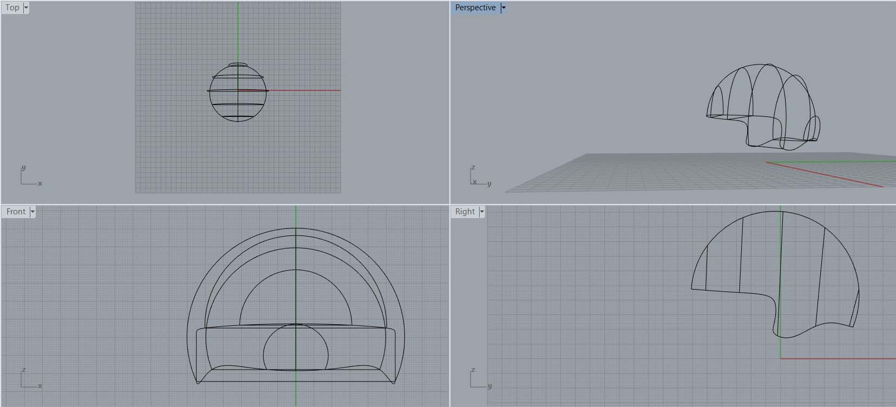
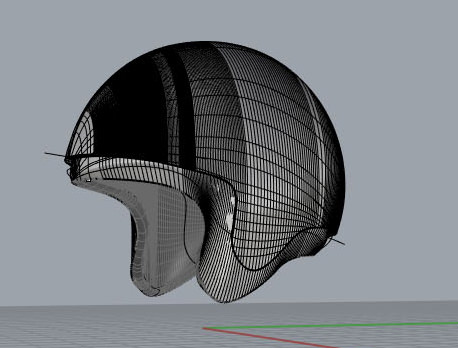
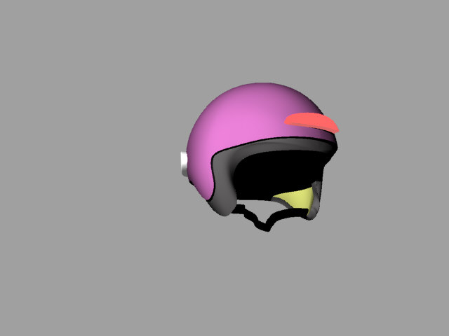
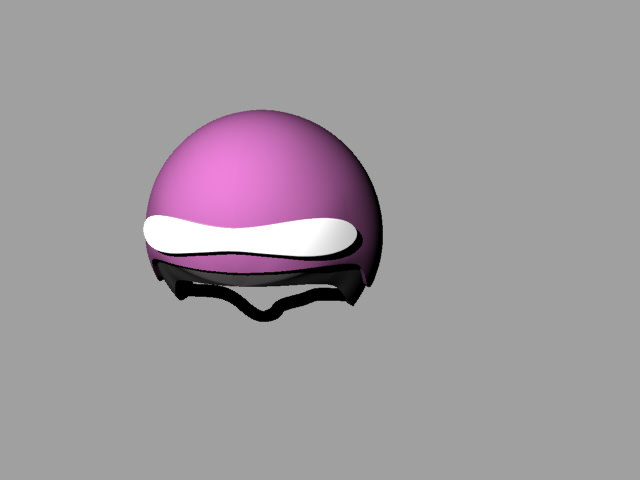
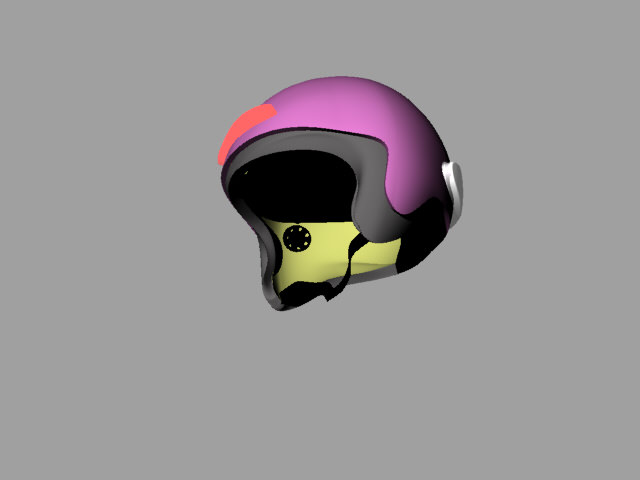
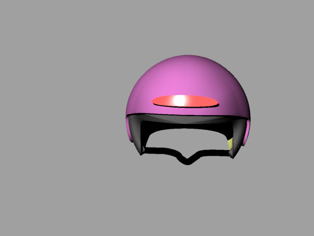

### Final Project Idea - a Smart Helmet

Our first assignment was to model possible final project.  
  
I commute mainly with bike, so my idea for the final project is a smart bicycle helmet.    
  
  
I would like to make a helmet that is controlled both from your phone and also from buttons on the handle bar.  
  
The helmet will have a front light and back lights, and you can turn on signal lights when making turns.  
It will also have an inside speaker, so you can listen to navigation instructions from you phone while riding.  

I used Rhino for modeling and rendering the desiered helmet.

<figure align="center">
	
	<figcaption>First steps of modeling</figcaption>
</figure>
<figure align="center">
	
</figure>
  
And the results:
<figure class="half">
	
	
</figure>
<figure class="half">
	
	
</figure>