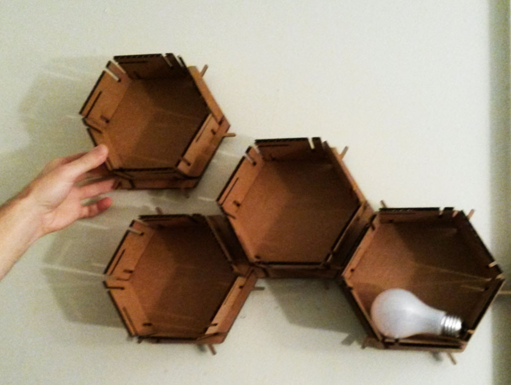

### Modular Honeycomb Shelves
The assignment this week was to design, make, and document a press-fit construction kit.  

I've recently moved to a new apartment and wanted to make some nice storage solution that
will be both pretty and functional.
My inspiration was the geometric simple design and infinity of honeycombs.  
  
I've used Rhino and Grasshopper to create the basic shapes the build hexagon boxes that can then build a honeycomb-like wall storage.  
My Grasshopper script gets as inputs the desired length of the hexagon sides, the thickness of the cardboard, and the laser offset. It is then outputs 3 shapes that I can send for printing (laser cutting)

The settings I've used with the Epilog laser cutter and given cardboard:  
speed: 25-29%  
power: 70-75%  
frequency: 25000  
Carbboard thickness: 4 mm  

<figure>
	
	<figcaption>Planning with Rhino and Grasshopper</figcaption>
</figure>

The basic unit is made out of the base hexagon, that can connect with other base hexagons and creates the tiling; The squares, that connect to the base hexagon and create the walls; And the back part, which binds the whole part together and also has holes so it can be hanged on the wall.  
  
I've set the length parameter in my model to be 10cm, the fun thing is that I can now change this parameter and create the honeycomb shelves any size I'de like.

<figure>
	
	<figcaption>Laser cutting the parts</figcaption>
</figure>

<figure>
	
	<figcaption>All parts, ready to be assembled</figcaption>
</figure>

<figure class="half">
	
	
	<figcaption>connecting the pieces</figcaption>
</figure>

<figure>
	
	<figcaption>Hanging on the wall</figcaption>
</figure>
<figure>
	
	<figcaption>Final result</figcaption>
</figure>
  
  
  

### Vinyl Cutting Fun

I've also got to play with the Vinyl Cutter machine this week.
I've made some fun stickers :)

<figure class="half">
	
	
</figure>