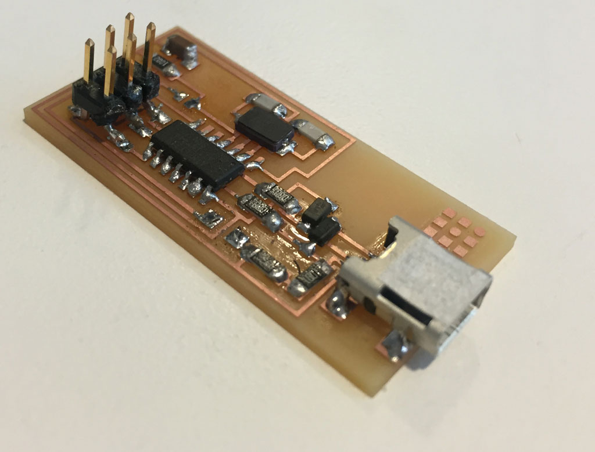
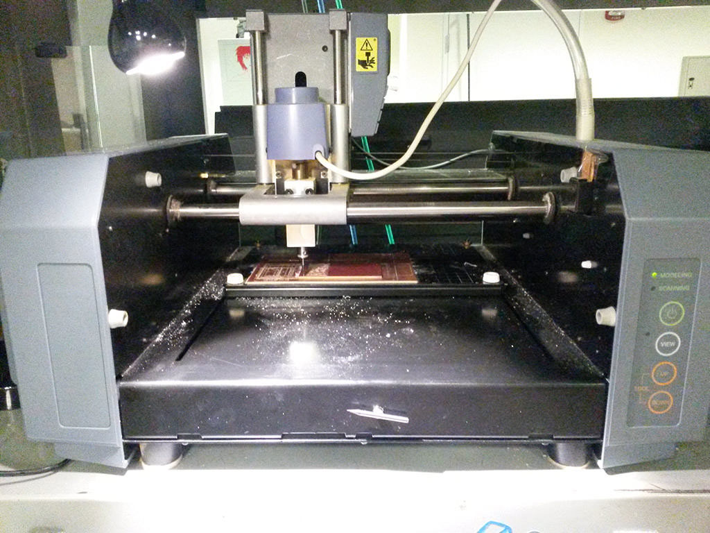
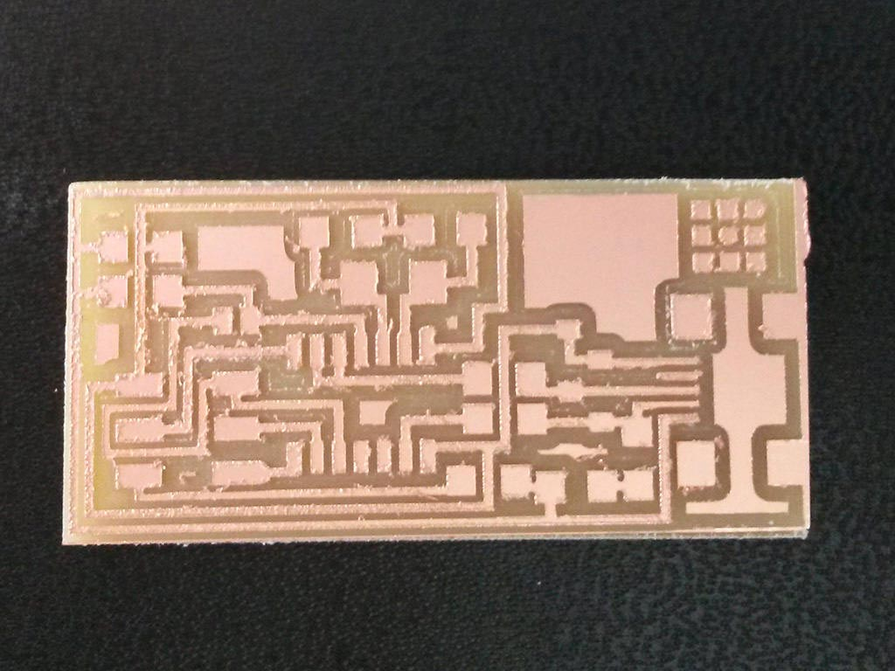
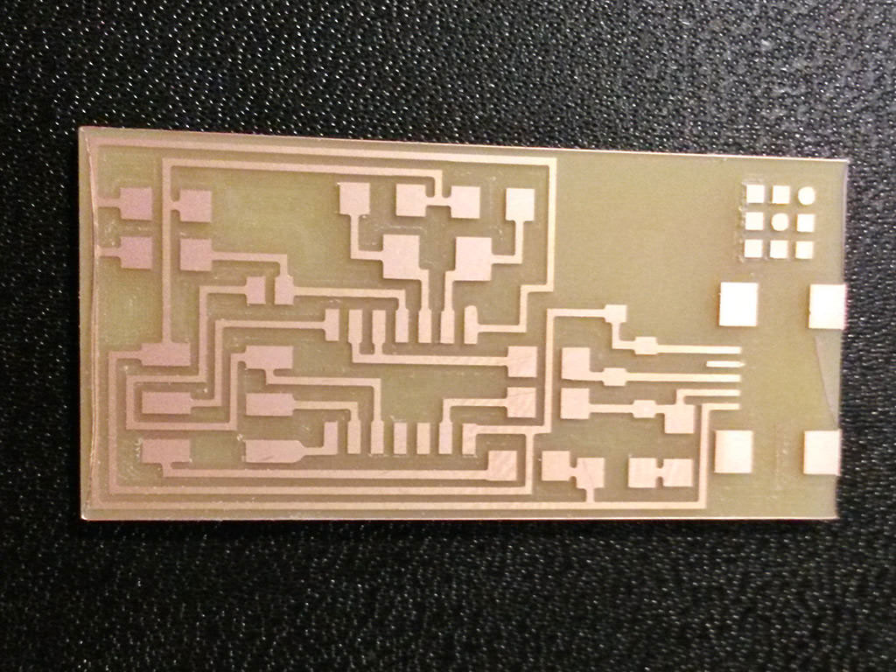
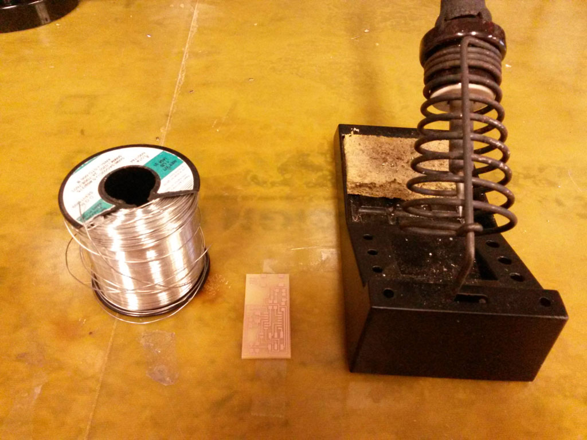
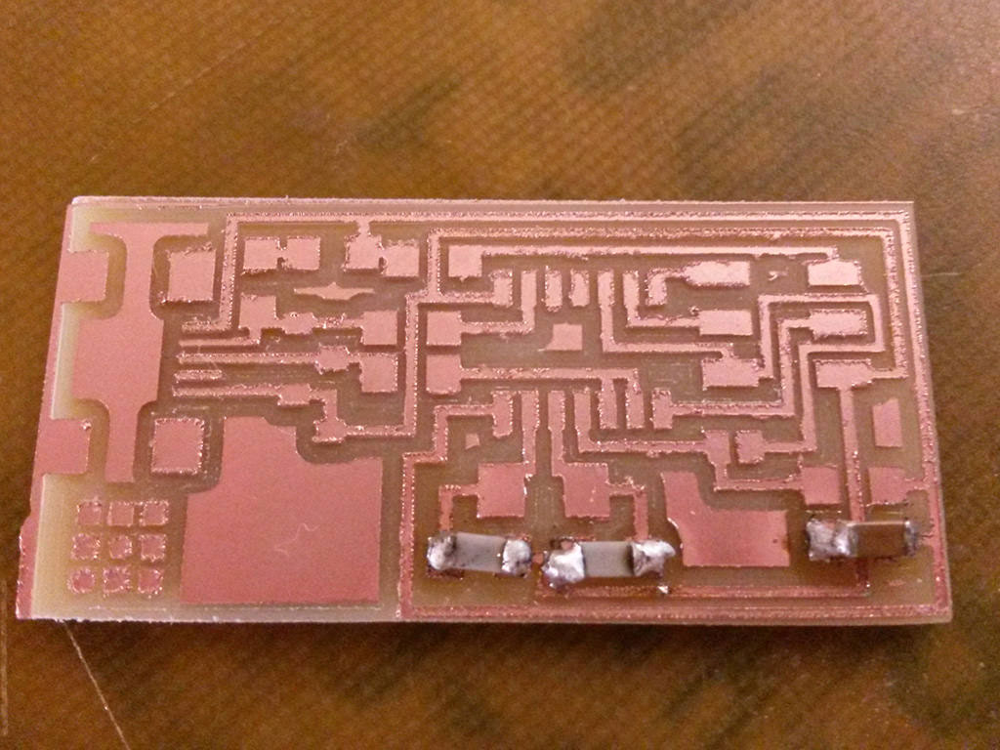
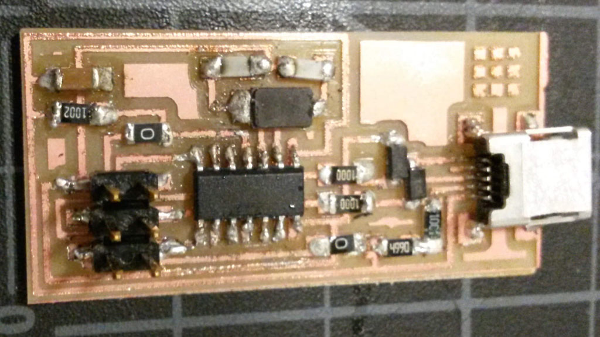
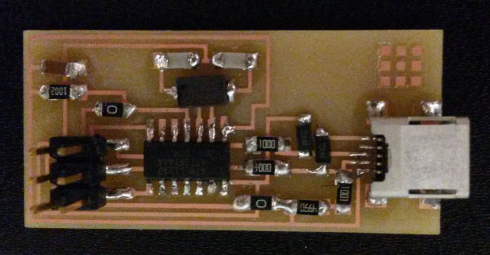
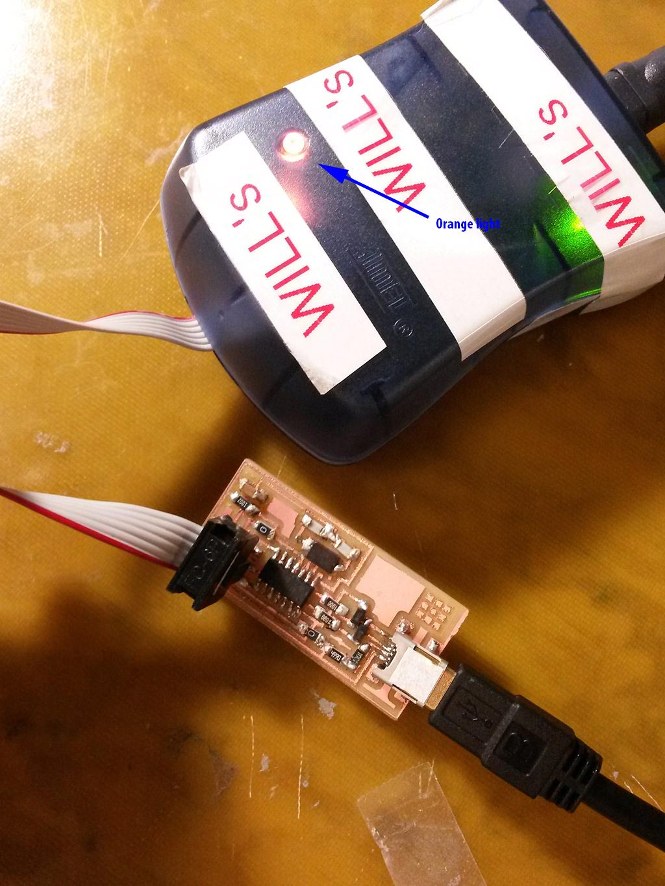
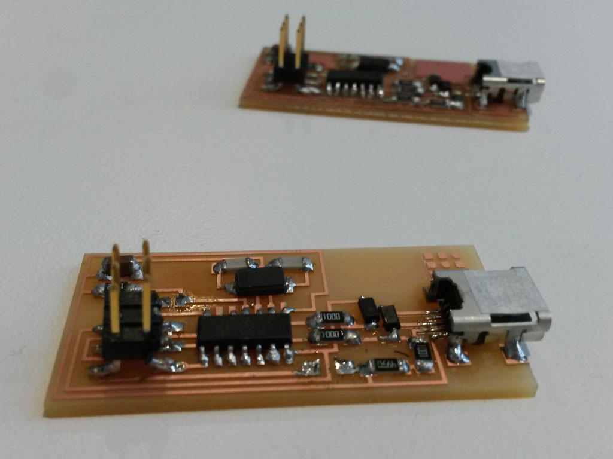

### My First Circuit Board  
<figure>
	
</figure>
The assignment this week was to make the FabISP in-circuit programmer.  
I've never dealt with electronics before, so I was a bit intimidated with this assignment.  
I Decided to work very slowly, step by step, to make sure I understand and do everything correctly.  
I followed [this great tutorial](http://fabacademy.org/archives/content/tutorials/05_Electronics_Production/Assemble_and_Program_FabISP.html) which was very helpful. 

The first time, after I finished stuffing the board with all components, I got an error saying I should double check connection and try again. After triple checking all connections and soldering with the help of Thras, our TA, we got to a conclusion that there is probably something wrong with the attiny44 chip, and it would be best if I just make a new board from scratch.  
I think this was a great decision. The second board took me less then half of the time to make, it came out prettier and worked perfectly. And also, most imporantly, I feel much more confident about my soldering skills now.  
  
#### Making the board:    

##### Milling  

The first step is milling the board.  
This is pretty simple. I just had to load the settings, that were already on the computer in the shop, to the [fab modules](http://fabmodules.org/). I used a new mill head so I changed the speed to 3.7 mm/s and the cut depth to 0.12 mm.  
<figure>
	
	<figcaption> Milling machine at work </figcaption>
</figure>
On my second board I changed the number of offsets to -1 in order cut everything but the traces, this took about 6 minutes more for milling, but preffer it since I think it looks cleaner, and is easier to debug that way.  

<figure class="half">
	
	
	<figcaption>First board on the left, 4 offsets.  Second board on the right, filled.</figcaption>
</figure>
  
##### Soldering
After milling comes the hard part - soldering.
 <figure>
	
	<figcaption> Solder iron and my board </figcaption>
</figure>

<figure>
	
	<figcaption>First steps</figcaption>
</figure>
<figure>
	
	<figcaption>First Board Soldered</figcaption>
</figure>

<figure>
	
	<figcaption>Second Board Soldered - The Soldering here is much nicer </figcaption>
</figure>

##### Testing and Programming The Board
The last step is connecting the board to the computer an program it to be a programmer.  
As mentioned, in my first attempt, this did not go well. I get blinking orange light on the ATAVRISP2 Programmer, which means something is wrong with my connections.
<figure>
	
	<figcaption>Orange light on the ATAVRISP2 Programmer</figcaption>
</figure>

At the second attempt this went great. I got green light on my first try.
After programming my programmer I removed the jumpers, and - voilà!
<figure>
	
	<figcaption>Finished board with the first board behind.</figcaption>
</figure>

  
