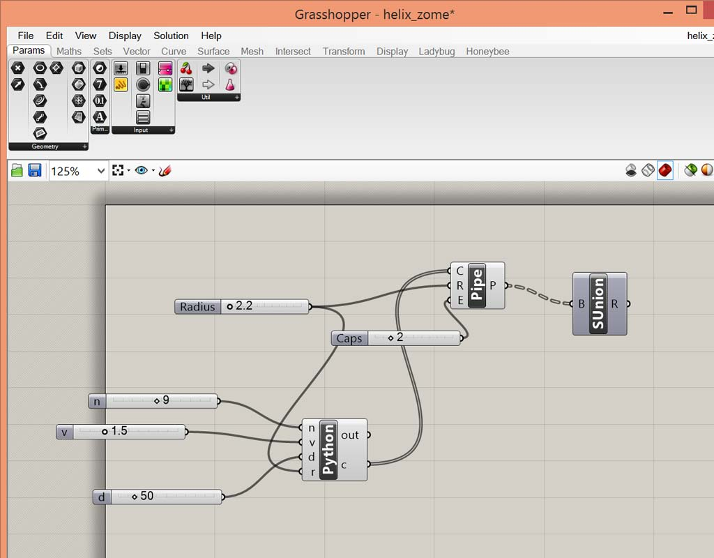
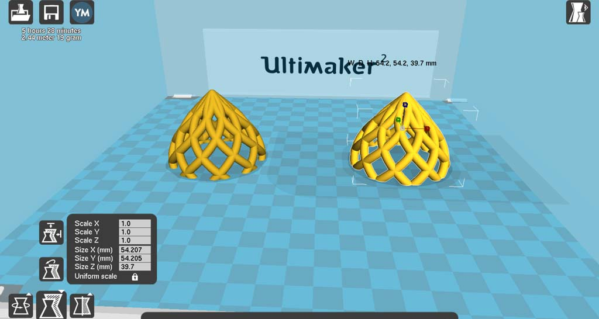
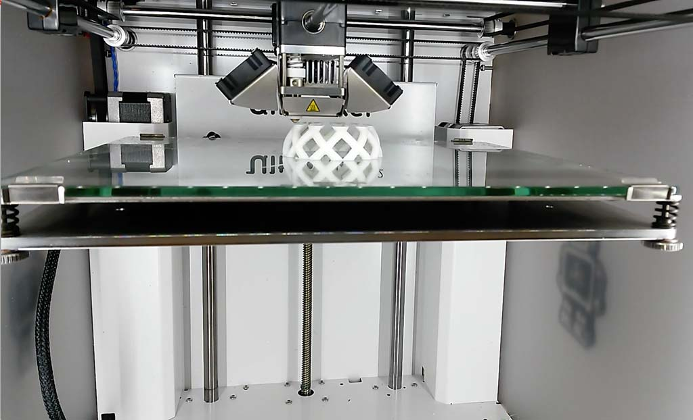
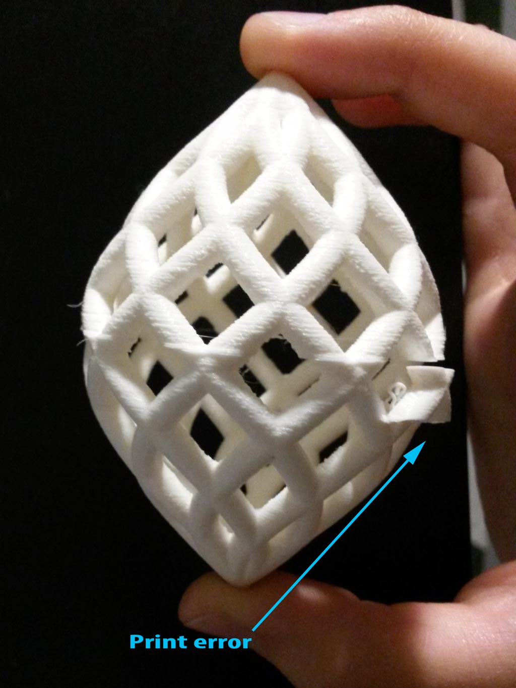

---
layout: page
weekNum: "Week 4"
title: "3D Scanning and Printing"
thumb: "images/week4/thumb.jpg"
excerpt: ""
comments: false
share: false
--- 
<figure>
	
</figure>  

### Designing and 3D Printing  
The first assignment of this week was to design and 3D print an object that could not be made subtractively.  
  
##### Design
I was Inspired by the [Helix Zome](https://www.simplydifferently.org/Helix_Zome) , that was developed by [Nicolas Causse](http://heliss.com/) in 2006. The term Zome comes from "zonohedron" + "dome" and is often used for unusual dome variants.
The fun thing is, that one of the ways of describing the helix zome is parametric, so I could, with a few changes, to model the zome using Rhino and Grasshopper.
In the original idea, since this is used as a zome, the helixes go from 0 to Pi. I wanted to create an egg shape, which is actually two zomes, so in my design α = -π .. π 

<figure class="half">
	
	
	<figcaption>The Grasshopper script and python code that create the model</figcaption>
</figure>
 
<figure>
	<!-- <video width="320" height="240" autoplay> -->
	<video autoplay loop>
    	<source src="../images/week4/movie.mp4" type="video/mp4">
		Your browser does not support the video tag.
	</video>
	<figcaption>Animation of completed basic model</figcaption>
</figure>  
I then added more modifications - Creating a small zome inside the zome, and making a zome from single helixes (removing the second for loop from the code).

My grasshopper scripts can be downloaded here:

* [Basic zome](../helix_zome.gh)  
* [zome with small zome inside](../zome_small_inside.gh)  
* [zome with only one set of helixes](../zome_one_side.gh)  

##### Printing
I've printed the three variations of the zome to test different printing options and parameters.  

###### A Zome Inside a Zome
I've created a model of a small zome (30 mm diameter) inside a bigger zome (70 mm diameter), not connected.
I've sent this .stl file to Tom at the CBA shop, to be printed by the Dimension 3D printer.  
The Dimension hase the advantage of printing a support material that is different from the printed material, and so I used this to print the complete model of the zome with the small zome inside - all in one piece.  
This could not be done using the ultimaker.  
This model is very complex and required a lot of support material. the printing took 20 hours.
<figure>
	
	<figcaption> The Dimension printer printing my model. You can't see much, just a lot of support material </figcaption>
</figure>
<figure>
	
	<figcaption> Final result - The Zome Rattle </figcaption>
</figure>
<figure>
	
	<figcaption> Zoom in on the small zome </figcaption>
</figure>

###### The Double Helix Zome
I also wanted to try and print with the Ultimaker 2. since the complete zome does not have a base, I would have needed a lot of support material to be printed, which would have make the print very long, and also I would had a lot of work after printing, cleaning the model.
In order to solve this issue, I cut the model in the middle, and printed each half separately. This way I could print with no support at all and it took a few seconds to glue the two parts after the print was finished. 
<figure>
	
	<figcaption> The two halves ready for print </figcaption>
</figure>

  
There is a little glitch in one of the prints. There was a small part that moved not long after the print started. but the Ultimaker managed to continue the print normally and I'm only left with this small print error on my model.

<figure>
	
	<figcaption> Beginning of the print </figcaption>
</figure>
<figure>
	
	<figcaption> Printing </figcaption>
</figure>
<figure>
	
	<figcaption> Finished half on the printer bed </figcaption>
</figure>
<figure>
	
</figure>
<figure>
	
	<figcaption> Completed model </figcaption>
</figure>
  
###### The Single Helix Zome
After these two prints came out successfully I decided to print a smaller zome, with single helix, which has a more interesting shape (in my opinion).  
I used the same technique as in the previous print with the Ultimaker - printing two halves and then gluing them together.
This print is my favorite.
<figure>
	
	<figcaption> Two halves </figcaption>
</figure>
<figure>
	
	<figcaption> The single zome </figcaption>
</figure>

<figure>
	
	<figcaption> The three zomes </figcaption>
</figure>  

I've also used this model for another assignment I had this week.  
[This](https://www.youtube.com/watch?v=EfQID5LcnuA) is a short movie documenting the design and print process.  

### 3D Scanning
The second assignment of this week was to 3D scan an object, and optionally print it.
I've tried 3D scanning before with different DIY methods - 123D catch app and a kinect sensor, and was never quite happy with the result.
I tried using the Sense scanner to scan my ear, but too many details were missing.  
  
 Since the fall is coming to Cambridge, there are lots of pine cones outside my house, and I really love pine cones. I decided to try and scan one with the NextEngine 2020i Scanner, that has 0.005" resolution.

<figure>
	
	<figcaption> scanning the small pine cone. I've made a base for the pine cone using hot glue so I could scan it in standing position and it did not move </figcaption>
</figure>
 
I used MeshLab to smooth and reconstruct the scanned model (Poisson Reconstruction, with the following parameters: Octree Depth - 11, Solver Divide - 7, Sample per Node - 1 and Surface offsetting - 1).  
I used Rhino to make a flat base for the pine cone.

<figure class="half">
	
	
	<figcaption>Refining the model using MeshLab and Rhino</figcaption>
</figure>

I printed the finished model on the Ultimaker.

<figure>
	
	<figcaption> The printed scan </figcaption>
</figure>
<figure>
	
	<figcaption> The printed model near the original pine cone</figcaption>
</figure>
 The results this time were surprisingly good!  

