---
layout: page
weekNum: "Week 5"
title: "Computer-Controlled Machining"
excerpt: ""
thumb: "images/week5/thumb.jpg"
comments: false
share: false
--- 
<figure>
	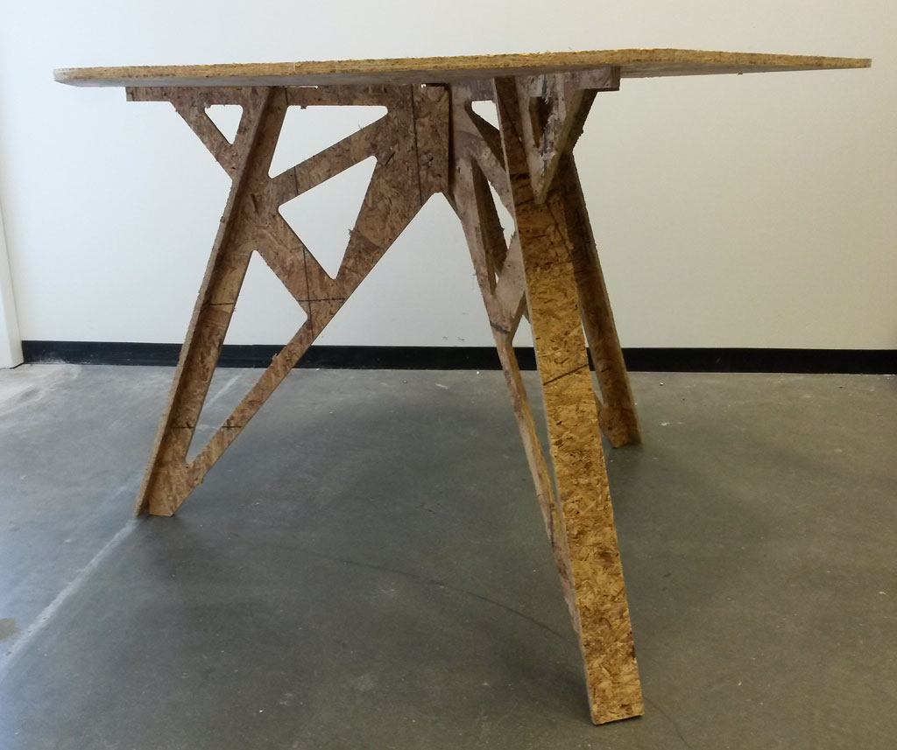
</figure>  

### 3 Legged Hexagon Table 
This week's assignment was to make something big.  
  
#### Design
I wanted to make a nice dining table for my apartment.  
I thought this would be a great opportunity to learn Solidworks and improve my CAD skills. It was important for me to keep my design parametric, so if I buy nicer wood with different thickness I could just change the thickness variable and cut the same design, I also wanted to be able to scale the table easily, or just change the hieght or diameter if I wanted to.

<figure>
	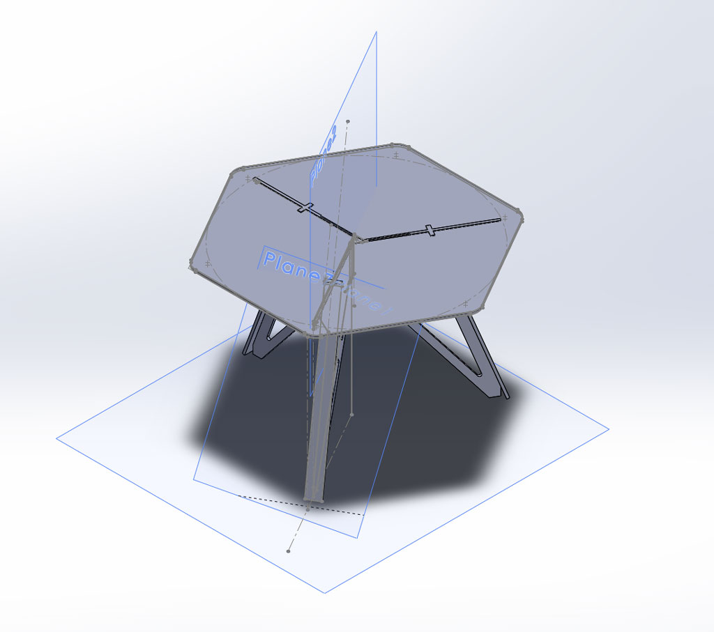
	<figcaption> The table top </figcaption>
</figure>
<figure>
	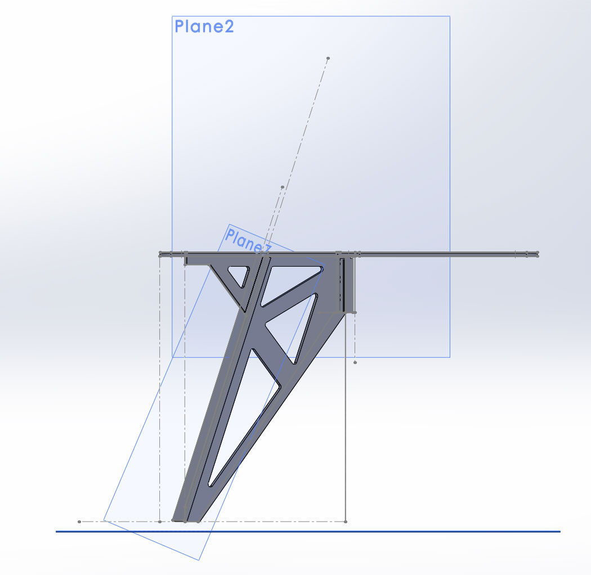
	<figcaption> Side view of the leg and support </figcaption>
</figure>
<figure>
	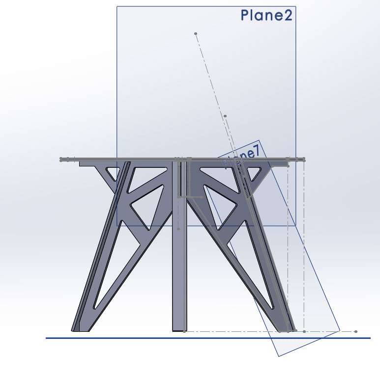
</figure>

The table is constructed from four different parts: the hexagon table top, the legs, support piece for each leg and a small triangle that sits in the hole in the middle of the table top.
In order to keep the table top as clean and as smooth as possible, I designed pockets in the lower side of the table top that are exactly the size of the table legs, so the table legs sit in those pockets, but are not seen on the table top, for it to sit exactly and not move, there is a this slot in each pocket, and a thin part on top of each leg (made by pocketing) that fits inside the slot. tha small triangle keeps everything together.  
The legs also fit together with the help of pockets in the intersection lines, so the can be as tight as possible with only the small triangle space between them.

#### Toolpathing:
We learned how to use the ShopBot and got a 4' X 8' OSB sheet, 7/16" thick.
The OSB is not a fun material, there were a lot of splinters around and in my hands. But except the splinters the milling came out good and accurate and the pockets looked good. 
I am planning to buy nice wood and cut this again, so this time I'll cut thing right. (and update this page with pictures of the nice table). 
 
<figure>
	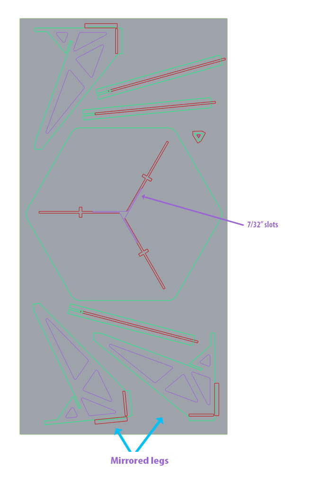
	<figcaption> The dxf file ready for toolpathing. Red is for pocketing, purple for cutting inside and green for cutting outside </figcaption>
</figure>  

#### Cutting

My design has slots for half of the material thickness (that pocketed parts fit in), these slots are 7/32" wide, so I could not make them with th 1/4" endmill.
Since the rest of the cuts could be made with the bigger endmill, I first cut everything with 1/4" endmill and then changed the endmill to 1/8" and cut the thin slots. 
<figure>
	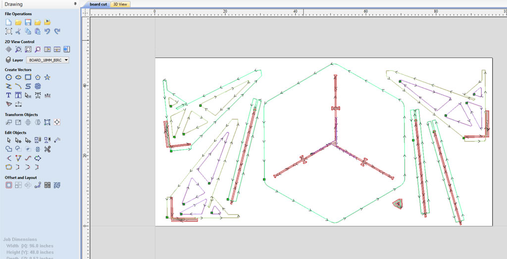
	<figcaption>  The toolpath ready for cut</figcaption>
</figure>  

<figure>
	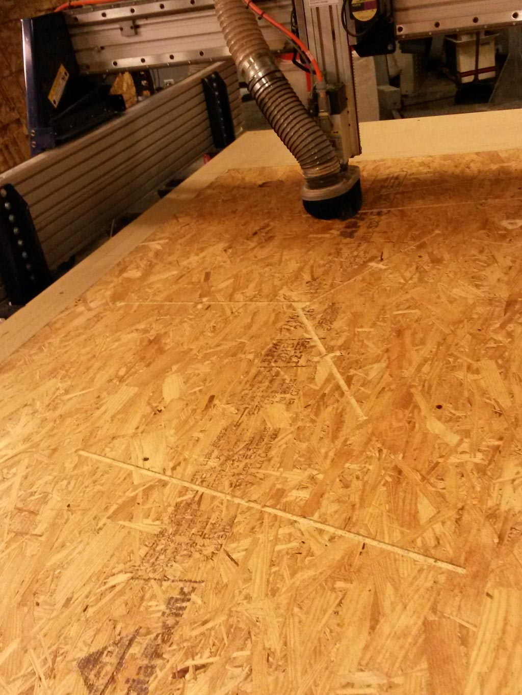
	<figcaption> The ShopBot cutting my part</figcaption>
</figure> 
<figure>
	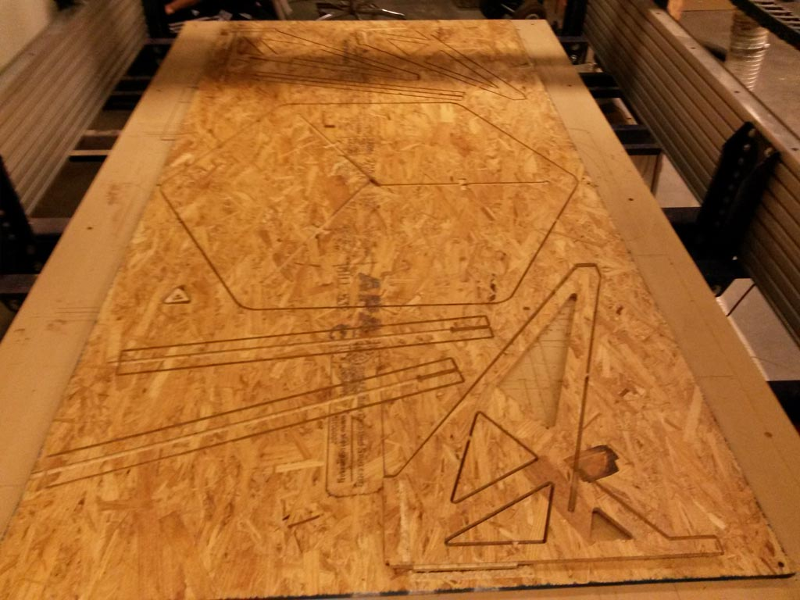
	<figcaption> The board ready </figcaption>
</figure> 

#### Constructing
I made a mistake while making the toolpath and mirrored 2 of the tables legs (explained more detailed at the notes of this post). Due to lack of time and material to cut new parts, I had to use wood glue and clamps to hold the parts together:

<figure>
	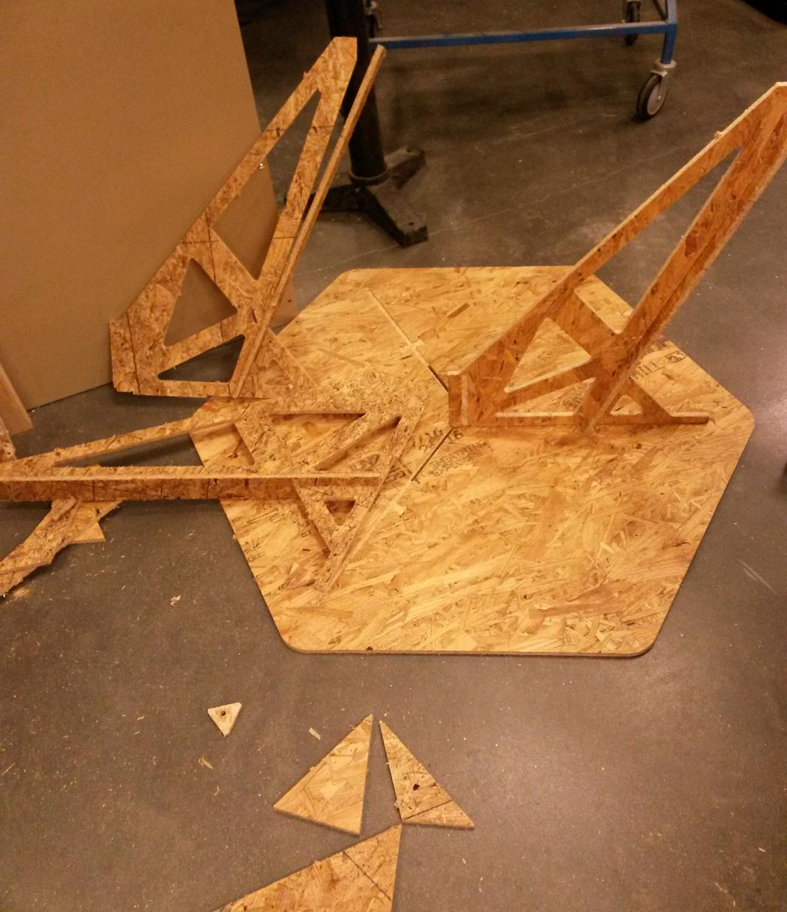
	<figcaption>  </figcaption>
</figure> 

<figure>
	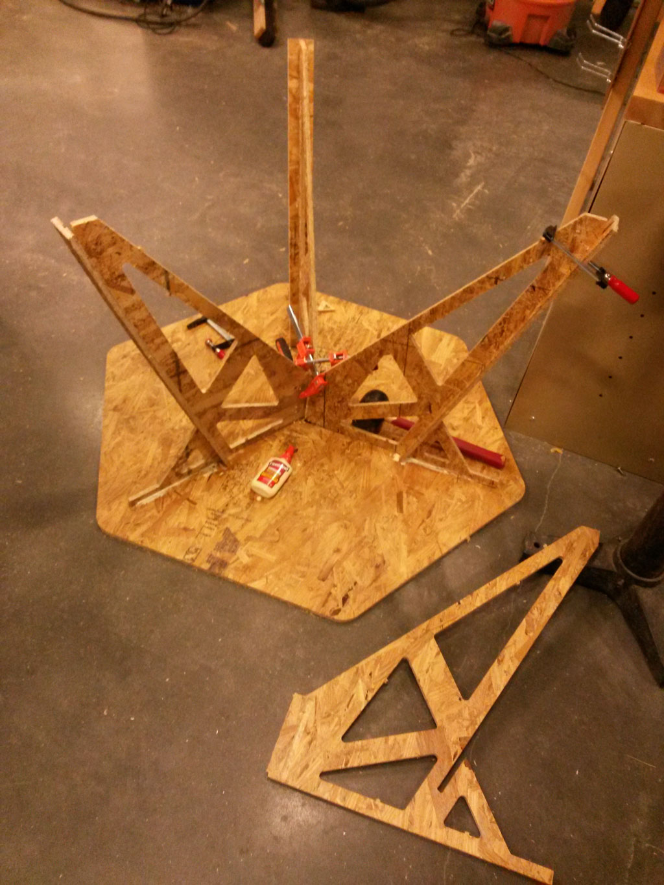
	<figcaption>  </figcaption>
</figure> 

I let the glue dry for 24 and this is the result:  
<figure>
	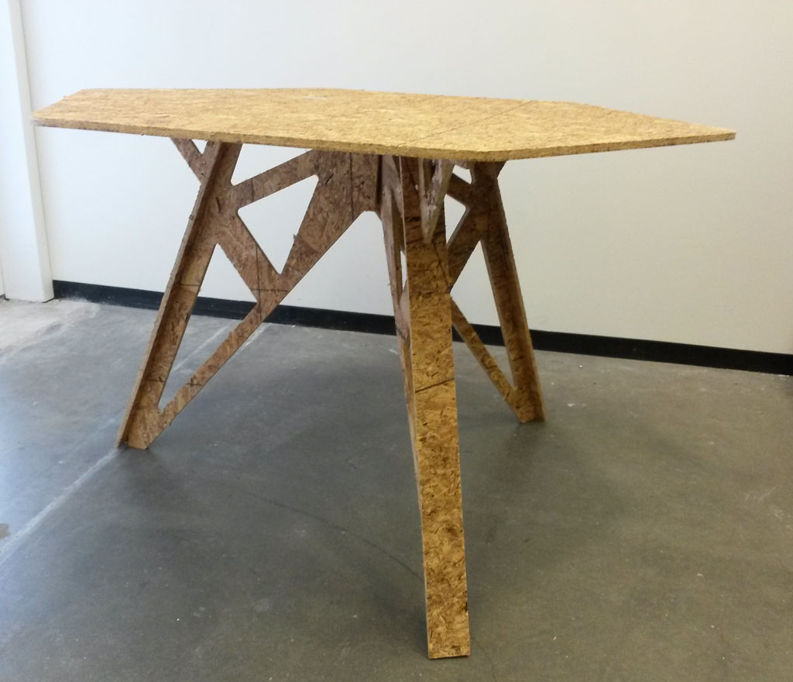
</figure> 
<figure>
	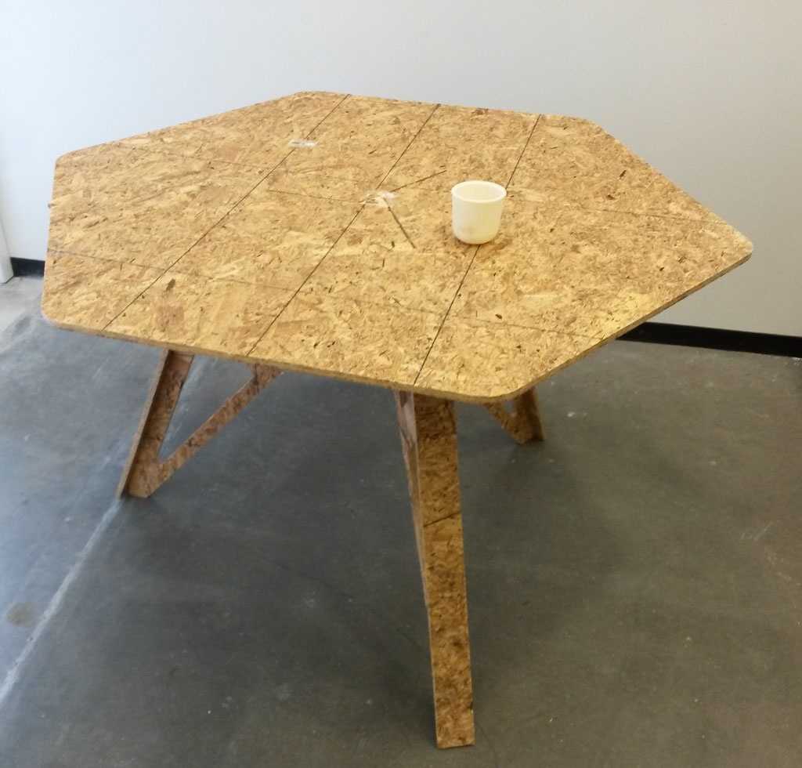
	<figcaption> Cup on table to demonstrate the size. Each hexagon side is 23", the table hight is 29" </figcaption>
</figure> 

All in all I'm happy with this table. I'm more happy that I learned a lot, both about working with Solidworks and parameters, and also about toolpathing and machining in general. I keep thinking of other things I now want and able to make.

#### Notes:
 - I learned a very important lesson during the toolpathing and cutting part: when making the toolpath for the cut, I was not thinking two much, and mirrored two on the legs to fit nicer on the sheet. since my design is not completely symmetrical (there are slots with 0.25" thickness, that pocketed parts go inside), the mirrored legs did not fit. since I did not have time and enough material to cut 2 new legs, I cut another mirrored one and made the desk by sanding parts in the legs that did not fit and gluing everything together instead of using the slots for construction.
 - During my online search for inspirations I ran into the really cool [Opendesk](https://www.opendesk.cc) website. Which is a global platform for local making. They have beautiful open source furniture designs that inspired my design a lot and gave me great ideas for the joints.
 - Note that it's very important where you put tabs, not inside slots! (luckily I learned that when cutting test parts for checking slots width.)
 - Expect to spend much more time on design when working with a new tool. Working with Solidworks took much longer then I planned to achieve the desired results.
