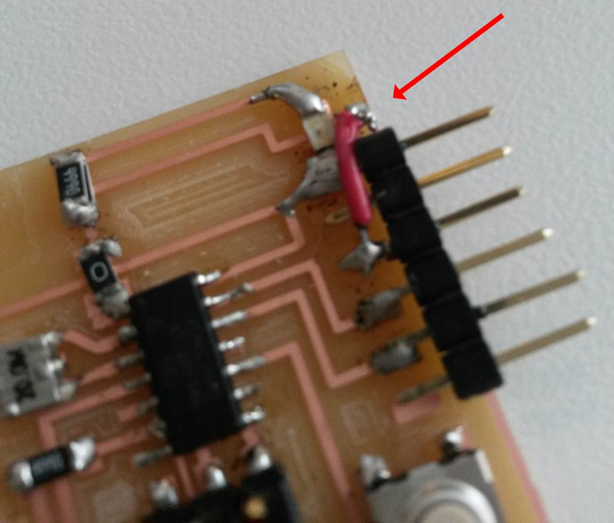

 
<figure>
	
</figure>
This week's assignment was to redraw the echo hello-world board, add a button and LED to it, and make it.  
Since I don't have any experience with electronics before, this week involved a lot of reading and learning. I do feel I had A LOT of progress in my electronics understanding since the beginning of this week.

<figure>
	
	<figcaption> Learning electronics </figcaption>
</figure>

#### Designing The Board
I used [Eagle](http://www.cadsoftusa.com/) for redrawing the board.
First, I added all the components from the [original board drawing](http://academy.cba.mit.edu/classes/embedded_programming/hello.ftdi.44.png) and then I connected them following the board traces.
I then added one LED from VCC to Ground, that will light when the board is connected to power (this should be an indication that the board is routed ok).  
I added another LED to PA7 I/O pin of the ATTiny44 and a button to PA3, so I can later program their behavior.
<figure>
	
	<figcaption> The board schematic </figcaption>
</figure>  
After designing the schematics comes the hard part of routing the board.  
This felt like and endless puzzle. Every connection I made got in the way of another connection. Eventually I added one jumper to solve my puzzle.  
<figure>
	
	<figcaption> Final board drawing </figcaption>
</figure>  
<figure>
	
	<figcaption> The traces I used. I added my initials using Photoshop </figcaption>
</figure>  
  

##### Making the board  
First I had to mill to board. since we already did this a few weeks ago, I was already familiar with the fab modules and the Roland mill.
<figure>
	
	<figcaption> Milling machine at work </figcaption>
</figure>
<figure>
	
	<figcaption> Milled board </figcaption>
</figure>
Next, I had to stuff the board with components, I wanted to use a 300-380Ω resistor for connecting the LEDs, since there were no such resistors in the CBA shop I put 499Ω on top of a 1kΩ, so they are in parallel, then the value is   =~ 330Ω
When soldering the board, I soldered the FTDI connector wrong, and when trying to de-solder it I accidentally also removed the copper trace that connected it's VCC pin to the board.  
I decided that before making the board all over again, I'll try to fix it with a hack. so I connected a wire from the FTDI pin to the VCC wire trace. surprisingly that worked.
<figure>
	
	<figcaption> Final board </figcaption>
</figure>
<figure>
	
	<figcaption> My wire hack </figcaption>
</figure>

I then wanted to test my board.
First I connected it to the power supply (my laptop) and the VCC -> GND LED lighted up. This was a very happy moment! :)  
 <figure>
	
	<figcaption> Success! </figcaption>
</figure>
Then I also connected it the programmer I made in week 3 and programmed it using [these instructions](http://academy.cba.mit.edu/classes/embedded_programming/hello.ftdi.44.program.png). That also worked well, and confirmed my board is working fine. I did not test the LED an button that are connected to the microcontroler yet. I'll do that in embedded programming week (which is week 8)
 <figure>
	
	<figcaption> Programming the board </figcaption>
</figure>

  
