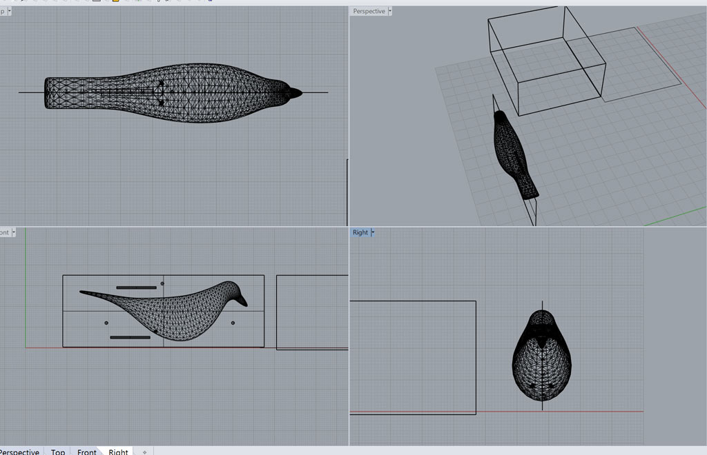

 
<figure>
	
</figure>
This week's assignment was to design a 3D mold, machine it, and cast parts from it.  
As a ceramic design student, I have vast experience in mold making.  
I've made a lot a plaster molds, used for [ceramic slipcasting](https://en.wikipedia.org/wiki/Slipcasting). I've also made many silicon molds for different plastics, plasters, and wax mold for glass casting.  
I've never designed a mold using CAD tools. I found out that this is a more complicated process than what I expected.  
Saying that, this new option of making CAD molds was really exciting and I'm sure I'll use this method again.

#### Design
Since this was a very busy week for me as an RA, I decided to make something simple - a homage to the [Eames famous house bird](http://www.sheilazellerinteriors.com/articles/the-black-house-bird).  

<figure>
	
	<figcaption> The Eames black house bird </figcaption>
</figure>  

I used Rhino for designing the mold. Modeling the bird itself was quite simple. I separated the bird's legs from the body, planning to glue them to the bird later, or using metal wires as legs instead.  
After the bird was complete I added a cutting plane in its center, in a size little bit smaller than the piece of wax we got, leaving some room for walls. I then also added keys (half spheres, added to one side and  excluded from the other). 

<figure>
	
	<figcaption> Designing with Rhino </figcaption>
</figure> 

#### Machining the model for molding  
There were a few mistakes in my design - I wanted to make the bird as big as I can, this made my walls too thin, and some of them were lost in the milling. Also, I've made the keys too small, not considering the end mill size, and they were barely seen on the wax.

<figure>
	
	<figcaption> Milling the piece of wax </figcaption>
</figure> 

We worked with PartWorks 3D for making the toolpaths for milling the mold. I wanted to fit the 2 sides of my bird on the same piece of wax. In the software there is no option of adding 2 stl files for one toolpath, nor  option for manually setting the origin of the model inside the material, The program automatically locates the model in the center of the material.  
I solved this issue by setting the material width in the program to be half of the width of my real material.

<figure>
	
	<figcaption> First side done </figcaption>
</figure> 

<figure>
	
	<figcaption> Two sides done. I lost 3 walls in the process </figcaption>
</figure> 

#### Making the mold  
I used cardboard pieces instead of the missing walls. I used putty to make a spout.

<figure>
	
	<figcaption> Ready for mold making </figcaption>
</figure> 

Then just poured Oomoo on it and left it for the night. (Oomoo is the silicon we used for mold making).  

<figure>
	
	<figcaption> Oomoo </figcaption>
</figure> 

I mold released quickly and easily and came out nice, except for one small bubble on the bird's head.

<figure>
	
	<figcaption> Finished Oomoo molds </figcaption>
</figure>

#### Casting  
Since the keys on my mold were too small, it was really hard to hold the two parts of the mold together correctly, and I decided to first cast each part separately.
<figure>
	
	<figcaption> Ready for casting </figcaption>
</figure>
<figure>
	
	<figcaption> Casting dryStone in two parts of the mold </figcaption>
</figure>

When taking the cast out, the bird legs were too thin and broke immediately. the bird's body parts were a bit stronger but still broke when I pressed them too hard together. I'll cast more parts when I have some free time (this is the fun things about molds - you can cast many parts out of one mold).

<figure>
	
</figure>

Eventually, when looking just on one half, it's not that similar to the Eames house bird, but I still really like the result.

<figure>
	
</figure>