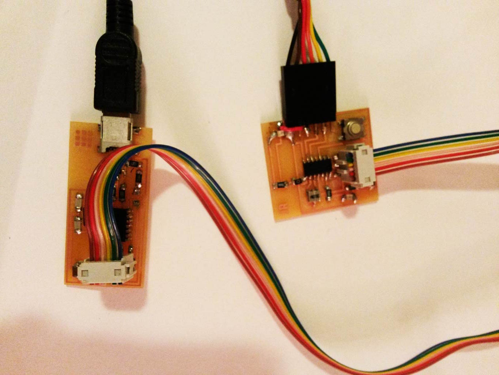
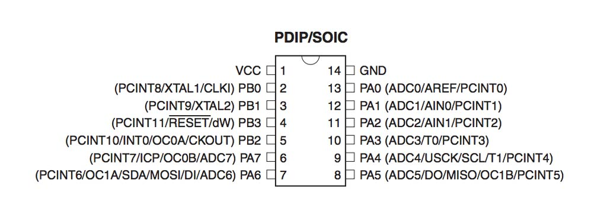
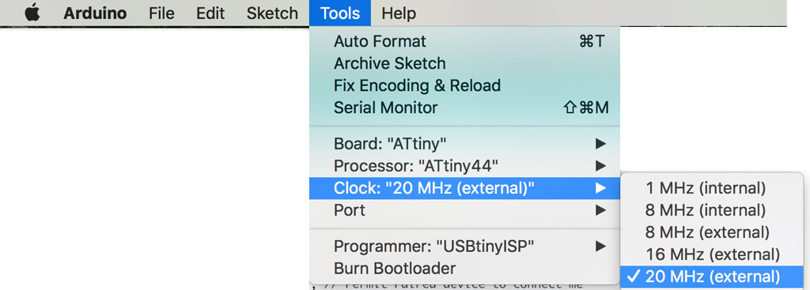
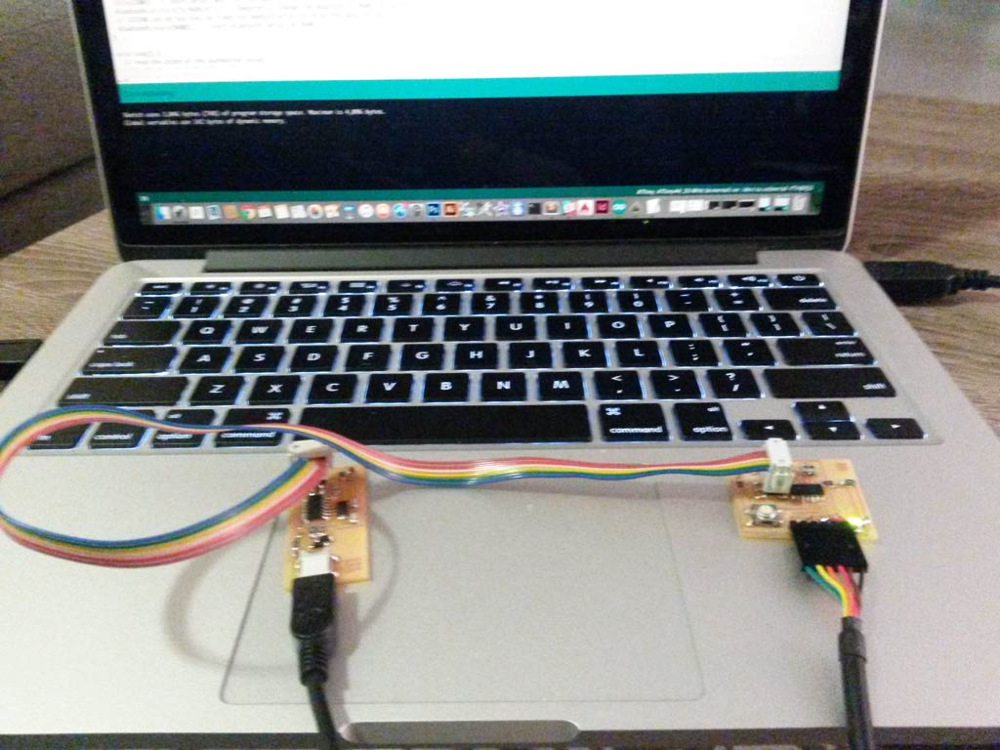
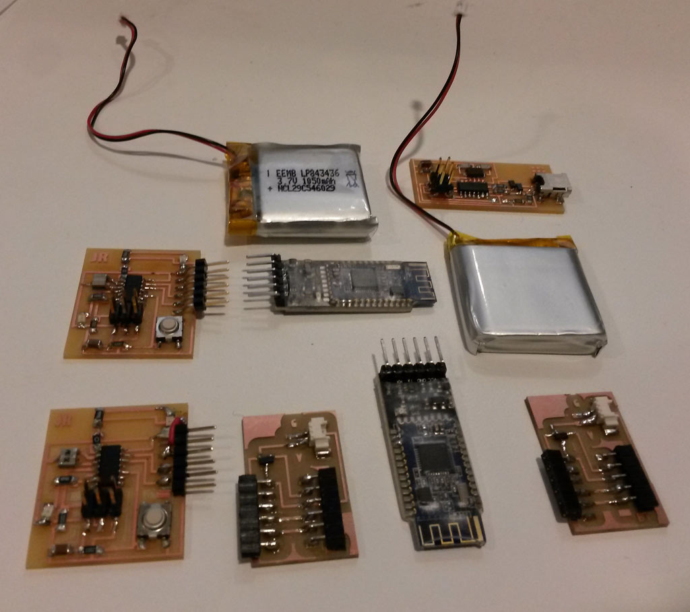
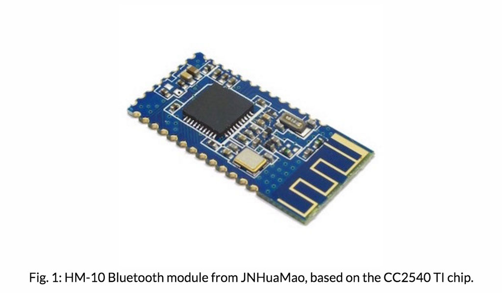
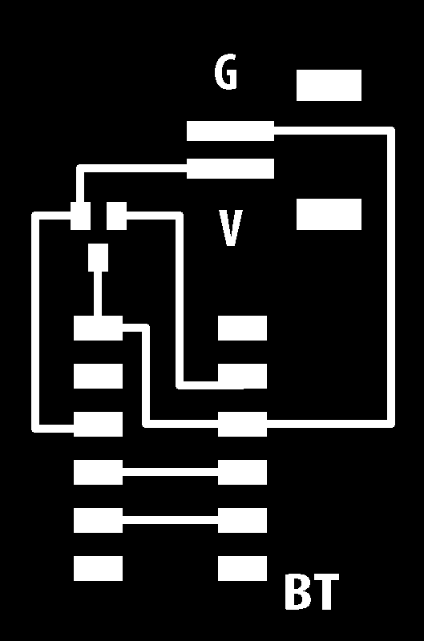
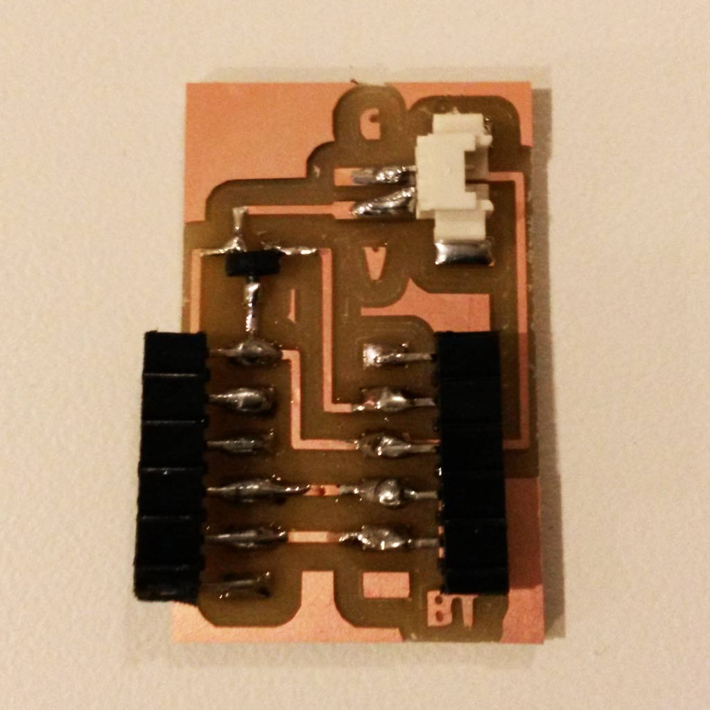
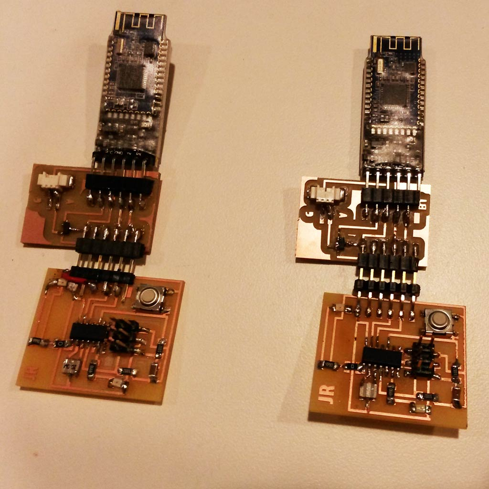
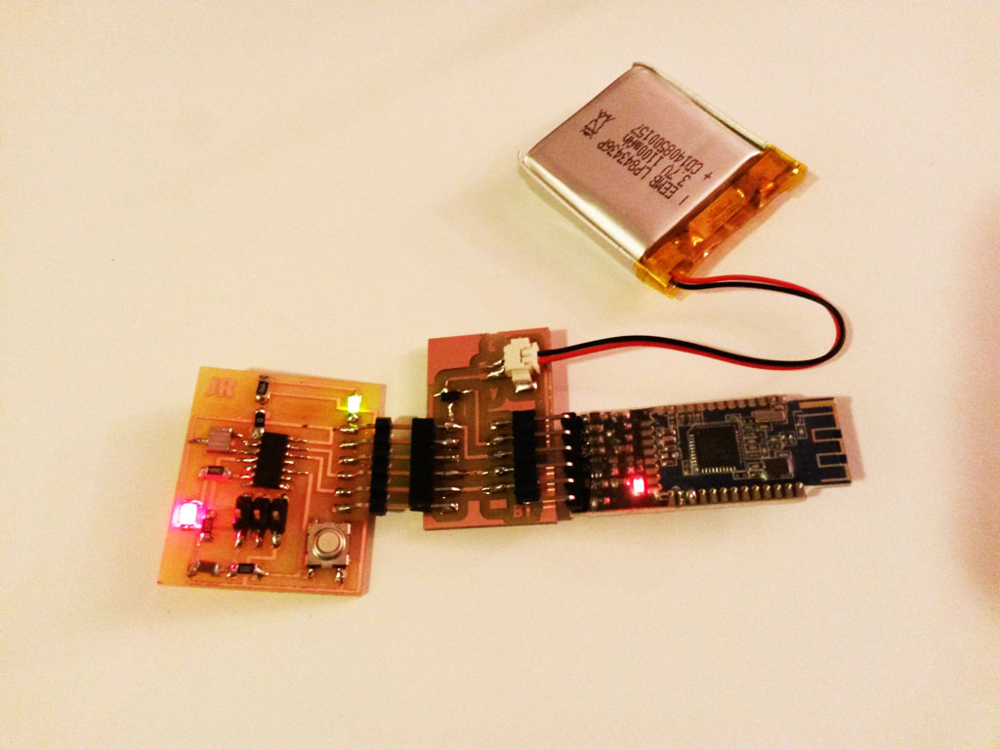

 
<figure>
	
</figure>

## Part 1 - Embedded Programing  

### A Morse Code Receiver and Transmitter  
This week's assignment was to program the board we made [two weeks ago](../week6-electronics-design/index.html) to do something, with as many different programming languages and programming environments as possible.  
I wanted to use all the features I have on my board - the button, the LED and the serial port, so I've decided to make a [Morse code](https://en.wikipedia.org/wiki/Morse_code) receiver and transmitter.  
When the board is connected to the computer, if you type a letter on the computer keyboard, the LED will blink that letter's Morse code. You can also press the button different combinations of dots and dashes (short and long presses) and the letter you pressed will print on the screen.

#### Programming the Board using Arduino IDE  
I used [this great tutorial](http://highlowtech.org/?p=1695) to get the Arduino IDE working with the ATTiny44 that is on my board.  
One very confusing point when programming with both plain C and the Arduino environment is the pins numbers:
<figure>
	
	<figcaption> This is the ATTiny drawing from the <b><a href="http://academy.cba.mit.edu/classes/embedded_programming/doc8183.pdf">datasheet</a></b></figcaption>
</figure> 
<figure>
	
	<figcaption> This is the ATTiny drawing from the tutorial </figcaption>
</figure> 
The pin numbers written in the second drawing are the correct one to use in the Arduino IDE.
Since I connected the LED to PA7 and the button to PA3 I used 7 and 3 accordingly.  
Another thing to notice is the clock settings in Arduino. My board has a 20Mhz Crystal on it, so I set the clock to 20Mhz (external) and had to click on "Burn Bootloader" before uploading the sketch to the board.
<figure>
	
	<figcaption> choosing the clock </figcaption>
</figure>  

Other than that I found it very nice to program the board using the Arduino IDE, thanks to all the libraries that are already written for it and makes a lot of things very simple and abstract.

<figure>
	
	<figcaption> programming the board using the programmer I made on <b><a href="../week3-electronics-production/index.html">week 3</a></b> </figcaption>
</figure>  

The sketch itself can be downloaded from [here](../images/week8/my_morse.ino).
I used binary numbers to represent to Morse code, in order to save space. 
A dot is represented by 0 and a dash by 1. All letters are sorted in an array and each letter location is it's Morse code.
Sorting the letters in the array is simple - since Morse letters can be sorted by a [binary tree](http://apfelmus.nfshost.com/articles/fun-with-morse-code/morse-tree.png) I just made a string of all the letters in the tree going over each row from left to right, adding question marks instead of empty node in the tree.

char* letters = "ETIANMSURWDKGOHVF-L?PJBXCYZQ.?54?3???2??+????16=/?????7???8?90?";


Interesting thing is that it uses 3,736 bytes (91%) of program storage space. Maximum is 4,096 bytes. That's a lot. The main reason is that for serial connection I use SoftwareSerial library, and this takes most of the memory space.

#### Programming the board with C  
I then wanted to create the exact same software in C, and test the memory usage difference.
In C, we use the same pin names as in the datasheet (so PA7 for my led and PA3 for my button).
I wrote the part of receiving letters from the keyboard and blinking Morse code. that worked fine (but took a lot more lines of code). I then needed to write a C implementation for Arduino function "millis()" , to count the elapsed milliseconds in order to get the time the button is pressed. this started to get a little bit too complicated and I left it aside for another time, in order to try and do some networking and communications as well.

## Part 2 - Networking and Communications  
<figure>
	
</figure>   
  
Since this year we are missing the networking and communications week, this was thought in this week's recitation and was given as a bonus assignment.  
The assignment was to design and build a wired or wireless network connecting at least two processors.  
For my final project, I'm planning to make a smart bicycle helmet, and put buttons on the steering wheel that will turn on turning lights on the helmet. I also want to add a small speaker inside the helmet the could give navigation instructions from a phone. This will require wireless communications between the buttons on the steering wheel and the LEDs in the helmet and also communications between the speaker in the helmet and the phone.  
I figured the best way to connect all the above would be Bluetooth and decided to try and implement a simple communication module this week.

I used the HM-10 Bluetooth module, that is explained in [Thras's tutorial](http://fab.cba.mit.edu/classes/863.15/doc/tutorials/programming/bluetooth.html)
<figure>
	
</figure>  
The BT module should be connected to the FTDI connection that is on my board, but then I had a few issues:
 - The same connection is also supplying the power to the board. 
 - The locations of GND, VCC TX and RX on each board are not similar.  
 - The HM-10 is rated to operate at a supply voltage of 2.0 to 3.7 volts, and its I/O are 3.3V tolerant! The ATtiny is more flexible and has operating voltage of 1.8 - 5.5V.
 - I couldn't find any female-female cables around the electronics shop and had to think of a creative way to connect the BT and the board. 
  
 After some thinking, Thras advised that I'll make a board that connects the two parts and also supply power. So this is what I did, I also added a 3.3V Regulator to that board for the BT.  

<figure>
	
	<figcaption> Traces for my small connecting board </figcaption>
</figure>

<figure>
	
	<figcaption> connecting board stuffed </figcaption>
</figure> 

I now have two boards connected to BT modules. hurray!
<figure>
	
</figure> 

Now comes programming the communication part.
For testing, I used the code from [this page](http://arduinofy.blogspot.com/2013/05/attiny-bluetooth.html)
changing RxD to 0, TxD to 1, and the led pin to 7.

I can now control the LED on the board by sending 0 or 1 from my computer, via Bluetooth, that's very exciting! :)  I'll continue to work on this on the following week, to be able to press the button in one board to light the LED on the other.  
<figure>
	
	<figcaption> Success. LED on board powered via Bluetooth </figcaption>
</figure>

  
