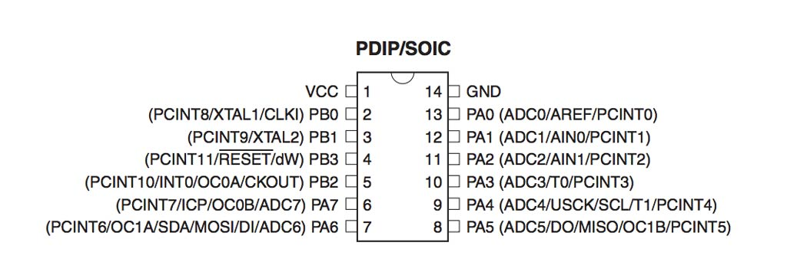

 
### Light and Sound 
<figure>
	
</figure>
 
This week's assignment was to add an output device to a microcontroller board we've designed and program it to do something.  
Since final assignments deadline is getting closer I'm trying to make things that I can use for my [final project](..week1-computer-aided-design/index.html) as well.
I want my smart helmet to have leds on it, that will blink when turning, and also a speaker inside, to tell you directions.  So for this week's assignment I wanted to make a microcontroller board with a speaker and LED Array.

#### Board Design
I've looked at Neil's designs for [LED array board](http://academy.cba.mit.edu/classes/output_devices/array/hello.array.44.2.png) and a [speaker board](http://academy.cba.mit.edu/classes/output_devices/speaker/hello.speaker.45.png)
And combined them to a new board using Eagle.
I've added a jack for power and a green LED between VCC and ground that is turned on when the board is connected to power.
<figure>
	
	<figcaption> My board Eagle schematic</figcaption>
</figure> 
<figure>
	
	<figcaption> My board Eagle schematic</figcaption>
</figure> 
All files for making the board can be downloaded here.

Neil is using a nice trick in the LED Array to avoid the use of a lot of resistors and keep the board cleaner - 
There are 2 layers to the board, and they are seperated with a vinyl-cut epoxy film sticker.
For doing this:  
You fisrt mill the traces of the board as usual.  
Then, you vinyl-cut apoxy film and stick it on top of the board.  
The you vinyl-cut coper and stick it on top of the epoxy film.  
  
###### To create the vinyl cutting files in eagle:  
####### The epoxy-film sticker:
When you are done designing the board hit *display none tCream*
Then go to view-> Layer settings and click on Change. Choose a solid filling for the tCream objects and export as a monochrom with 600 DPI
I then used photoshop (But any simple paint software will work) to crop and invert the exported image.
####### Copper traces on top: 
The important thing to remeber here is that the vinyl cutter resolution is not the same as the milling machine's. ** Use thicker lines **. The rest is easy, draw the traces on a different layer (I used bottom since I have the free version of Eagle and it only allows 2 layers) and export this layer only.  Again, invert and crop in any paint software.

#### Making the Board
This was not very different then making boards in the recent weeks. I only got much better and faster in producing boards :)
(And an LED Array requires A LOT of soldering).  
<figure>
	
	<figcaption> First version of the board milled</figcaption>
</figure> 
<figure>
	
	<figcaption> putting the epoxy film sticker</figcaption>
</figure> 

<figure>
	
	<figcaption> And the copper traces</figcaption>
</figure> 

#### Programming the Board 
This was the exciting part.
I first tested that each output device works by uploading Neil's code.
The LED Array was great:
<figure>
	
	<figcaption> LED array at action</figcaption>
</figure> 

The speaker was not that simple - when first uploading Neil's code nothing happened. 
(I suspected this was related to the fact the I used an Atitny 44 while Neil used Attiny 45 but did not succeed in debugging this, The code did compile and uploaded succefuly to my board, now I'm thinking this was a power issue and I should test this again with a different power supply).
I then tryed using Arduino Tone() library, but still, I heard nothing out of the speaker.  
After some reading around the web, I found [leah buechley's code for getting sound from a LilyPad] (http://web.media.mit.edu/~leah/LilyPad/07_sound.html) and this magically worked.
<figure>
	
	<figcaption> Video - Speaker working</figcaption>
</figure> 
This was still not stable and the speaker would sometimes just click when I pressed to button. That issue eventually resolved by replacing the power suply to higher current (1 amp instead of 0.2). Next time I should add a resistor to the speaker to solve that.  
  
Then I had a lot of fun playing different 8 bit tunes /i found online and composed my self, and lighting the LED's in different shapes
<figure>
	
	<figcaption> A blinking heart</figcaption>
</figure> 

<figure>
	
	<figcaption> A moving arrow I can use on my helmet to signal turning direction</figcaption>
</figure> 

Eventually, I experimented with combining the light and sound output - I've created random lights that are show with each note of the annoying sound being played :)

<figure>
	
	<figcaption> Final Video</figcaption>
</figure> 

My code is a combination of Leah's sound_code and Neil's [hello.array.44.2] (http://academy.cba.mit.edu/classes/output_devices/array/hello.array.44.2.c)
And it uses "pitches.h" from the Arduino Tone() Library.
see it here.

  
