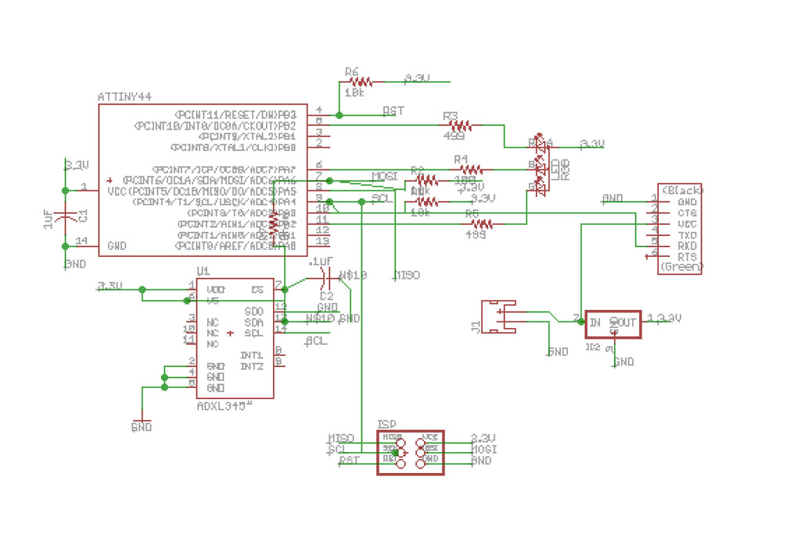
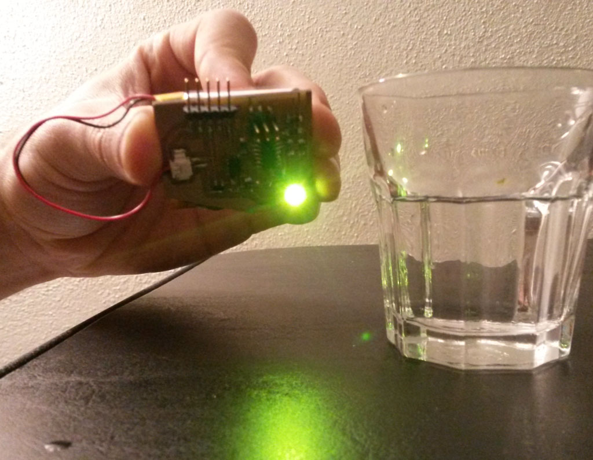

 
### Accelerometer
<figure>
	
</figure>
 
This week's assignment was to measure something - adding a sensor to a microcontroller board that we have designed and read it.  
Still working towards my [final project](../week1-computer-aided-design/index.html) I wanted to try and work with a 3d accelerometer, so I can later add one to my smart helmet and use it to detect braking and turn on braking lights.  

#### Board Design
I wanted to use both the [ADXL343](http://www.analog.com/media/en/technical-documentation/data-sheets/ADXL343.pdf) Accelerometer and an RGB LED to show the accelerometer read values.
PA4 and PA6 an the Attiny 44 are SCL and SDA for connecting to the accelerometer.  
For the RGB LED I just made sure I'm using PWM pins (so I'll be able to program this with Arduino IDE later).  
I also added a FTDI header for calibration and debugging the board, and a battery connector so I can move my small board around, attach it to my bike helmet, etc.  
The ADXL343 needs 3.3V so I've added a regulator and calculated the resistors values for the LED the match that.

<figure>
	
	<figcaption> My board Eagle schematic</figcaption>
</figure> 
<figure>
	
</figure>   

[Sparkfun's Eagle libraries](https://github.com/sparkfun/SparkFun-Eagle-Libraries) has an ADXL345 lib (in sensor's category) which I used for the accelerometer. I had to tweak the pads sizes to be able to mill it with a 1/64" endmill.
For doing that:  
- From eagle main screen, locate the part you want to edit and double click on it.  
- This will open the part edit screen.  
- On the left toolbar - press the wrench tool, the choose SMD and choose the desired pad size.  
- click on each pad you need to tweak. rotate and move if needed.    

On the first iteration I forgot to route the Accelerometer SDA pin to the microcontroller and this took me a while to debug. 

#### Making the Board
This process took the longest time this week, which I didn't expected since I made a bunch of boards before.
The reasons for the long time varied - the milling was not great, since the ADXL 345 pads are really tiny, some of the copper pads fell off the board during the milling.  
I tried using a 0.010" endmill but it broke a few seconds after the milling started.  
I also made the outline file wrong and it removed on of the traces (which I fixed with a jumper wire).  
Some of the issues I found out only later into soldering a wrong milled board, so a big lesson I learned this week was - **Always test the board very very carefully before you start soldering**  

<figure>
	
	<figcaption> Some of the milled boards I collected this week</figcaption>
</figure> 

<figure>
	
	<figcaption> Missing traces I found out missing only when done soldering</figcaption>
</figure> 

Another big challenge in making the board was soldering the tiny accelerometer.
<figure>
	
	<figcaption> The accelerometer on my finger - tiny</figcaption>
</figure>
Neil showed a nice method of doing reflow using the hot air gun, which looks so pretty and simple on [this picture](http://academy.cba.mit.edu/classes/input_devices/accel/hello.ADXL343.reflow.jpg)  
When I tried, it turned out to be a little bit more complicated.  
I shortened the board a few times and did not connect the accelerometer correctly a few times until I learned the exact amount of solder to use and right amount of time to reflow.
I still don't master this method but I certainly improved.

One good thing to do is to start with soldering the accelerometer on an empty board, then using a multimeter to test that nothing is shortened before continuing to the other parts.

Each time after I finished soldering a board I tried uploading Neil's example codes for RGD LED and the ADXL to make sure everything works. most of the times the RGB LED worked perfect but no input from the accelerometer.

After some trial and error, debugging and desoldering, I got a working board.

<figure>
	
	<figcaption> Final board</figcaption>
</figure>  

#### Programming the Board  
All the making issues I had this week did not leave much time for programming the board and I didn't get the chance to work on detecting a brake as I originally planned.  
Now that I have the board working though, I'm hoping to get back to this before the final project submission.  
  
Instead I read the X Y Z values from the Accelerometer and change the RGB color accordingly.
I used  Adafruit's [TinyWireM library](https://github.com/adafruit/TinyWireM) to read the accelerometer values.

<figure class="third">
	
	
	
	<figcaption>The LED changing colors according to the board position</figcaption>
</figure>

