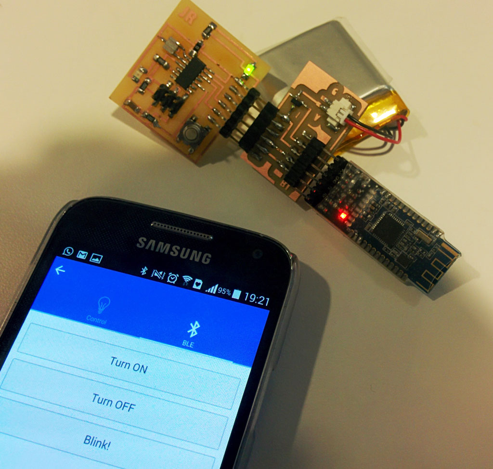
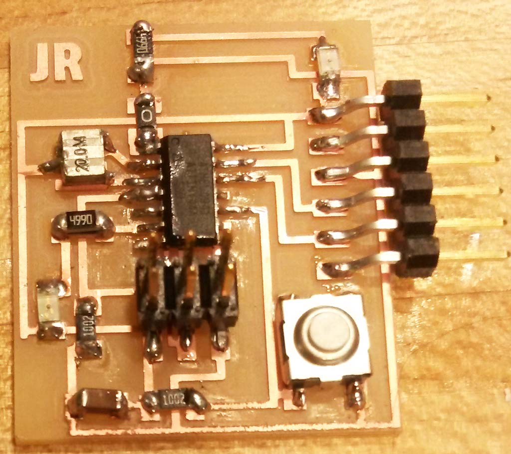
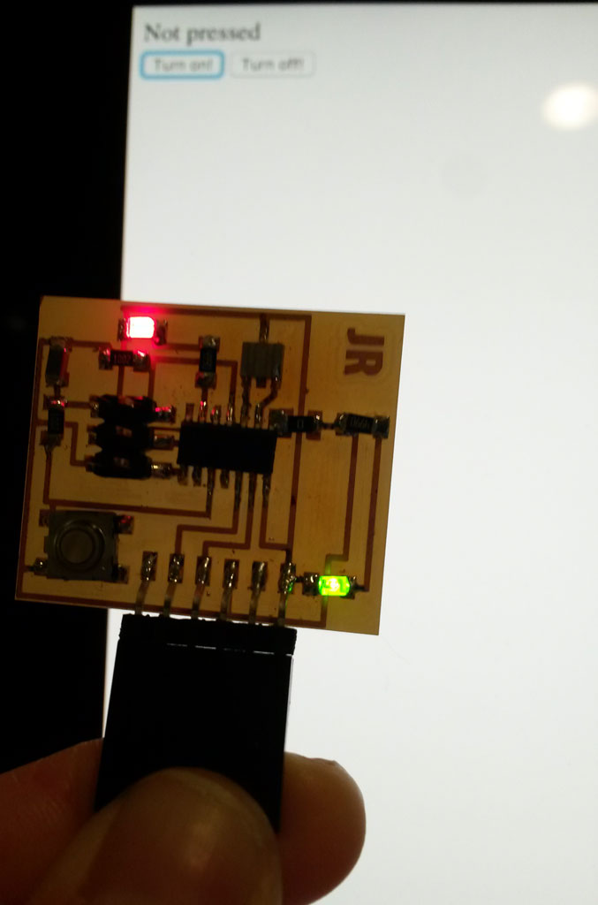
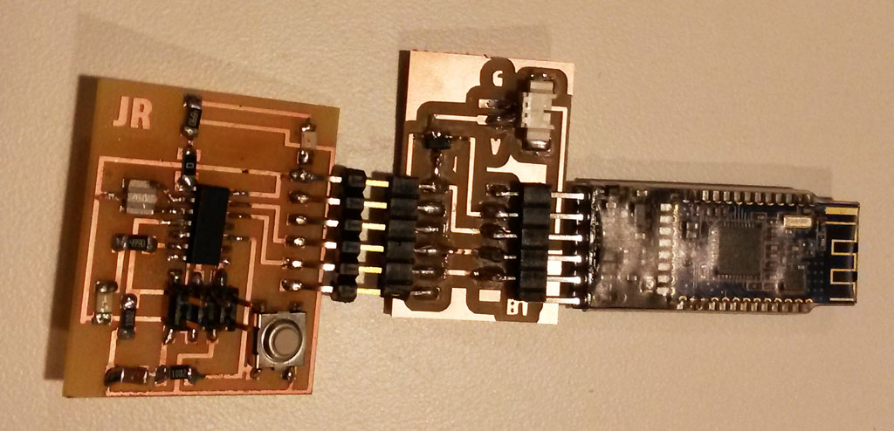
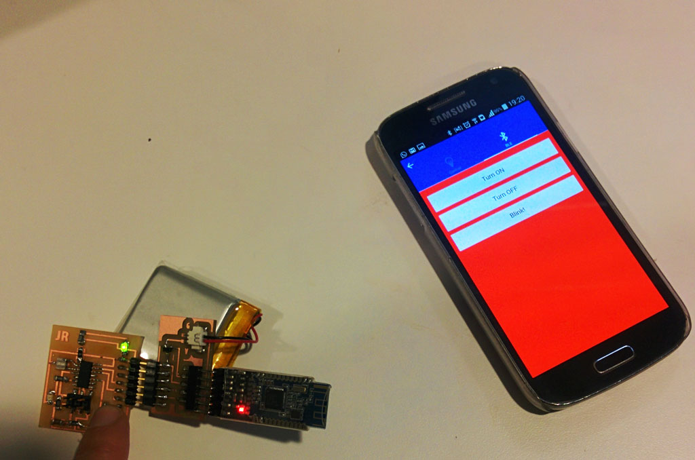
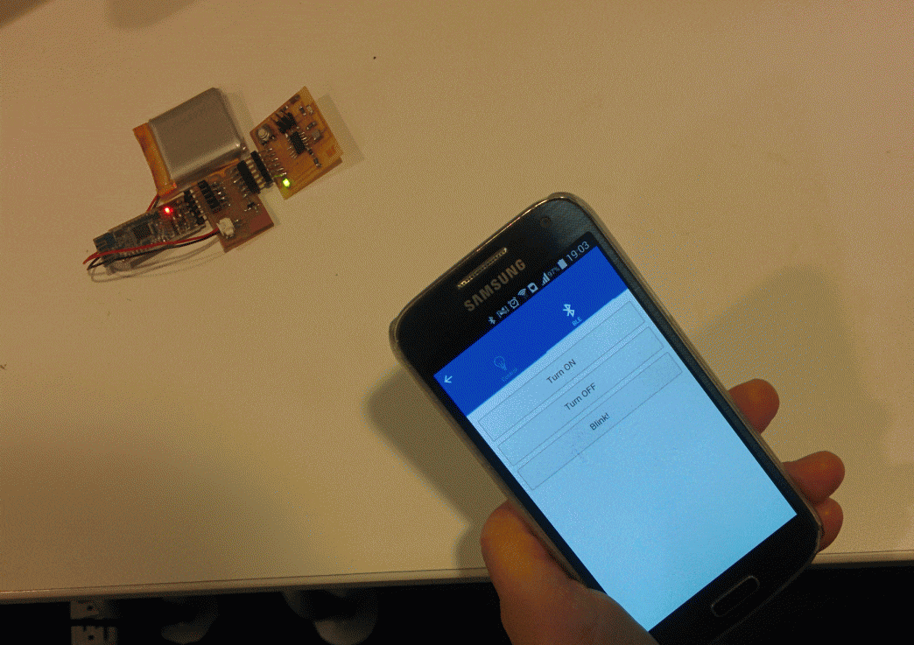

 
### Button input and LED Control
<figure>
	
</figure>
 
This week's assignment was to  write an application that interfaces with an input or output device that we made.  
I've decided to use the board I made on [week 6](../week6-electronics-design/index.html) which has an input device (a button), an output device (red LED) and a way to communicate with a serial port (FTDI header).
<figure>
	
	<figcaption> My board from week 6, with FTDI, LED and a button</figcaption>
</figure>  

On [week 8](../week8-embedded-programming/index.html) I added a bluetooth module to this board and was interested in writing an interface for that as well.

#### Programming the board  
In order to make an interface for the board, I had to also program the board itself.
Since my board has an FTDI header on it. I am using serial communication for sending and receiving data from the board.
(I'm using the Arduino [SoftwareSerial library](https://www.arduino.cc/en/Reference/SoftwareSerial))  

The board programming is not separate from the interface programming, and I iterated over this until I got the board to do exactly what I want. (programming the board, developing the interface, changing both...)
The board I programmed to send '0' when the button is not pressed and '1' when the button is pressed.  
Also, it turns on the LED when '1' is sent, turns it off when '0' is sent and blinks it when '2' is sent.

I used the Arduino Serial Monitor to test my code. (This is the magnitude glass icon on the top left of the window)  

The Arduino code looks like that:  



#include <SoftwareSerial.h>

#define LED            7                // The digital connector port to LED anode
#define BUTTON         3                // The digital connector port to the button

int ledState = LOW;
boolean blink_state = false;
unsigned long previousMillis = 0;        // will store last time LED was updated

const long interval = 500;
 
SoftwareSerial mySerial(0, 1); // RX, TX 

void setup() {
  pinMode(LED, OUTPUT);                  // Set the LED output
  pinMode(BUTTON, INPUT);                // Set the button input
  digitalWrite(LED, LOW);                // Turn off the LED
  mySerial.begin(9600);   				 // Init the serial port
}

void loop() {
  if (digitalRead(BUTTON) == HIGH) { // if the button is pressed  if (digitalRead(BUTTON) == HIGH) { // if the button is pressed
    mySerial.write(1);
  }
  else {
    mySerial.write((byte)0);
  }
  delay(100);
  if (mySerial.available() > 0) { // if there is data available on the serial port
    char c = mySerial.read();
    if (c=='1') {
      blink_state = false;
      digitalWrite(LED, HIGH);
    }
    else if (c=='2') {
      blink_state = true;
    }
    else {
      blink_state = false;
      digitalWrite(LED, LOW);
    }
  }
  unsigned long currentMillis = millis();
    if (currentMillis - previousMillis >= interval) {
    // save the last time you blinked the LED
    previousMillis = currentMillis;

    // if the LED is off turn it on and vice-versa:
    if (blink_state) {
      if (ledState == LOW) {
        ledState = HIGH;
      } else {
        ledState = LOW;
      }
    // set the LED with the ledState of the variable:
    digitalWrite(LED, ledState);
    }
  }
}



#### Javascript and HTML interface programming
I wanted to try and use javascript and HTML for the initial programming, due to a number of reasons:  

* The other good option was python, which I already used a lot in the past, and I wanted to learn something new.  
* I have other projects that require web development and this was a good opportunity to improve my skills.  
* I wanted to later make this a mobile app that controls the board through Bluetooth and web development is a good starting point for later using [Ionic](http://ionicframework.com/), which I also wanted to try.  

Programming the web interface was pretty straight forward using Neil's magnet example.  

###### board.html file:  



<html>
<body>

	

	<button  type="button" onclick="turnOn()">Turn on!</button>
	<button itype="button" onclick="turnOff()">Turn off!</button>
	<button itype="button" onclick="blink()">Blink!</button>

	
</body>
</html>



###### board.js file:


var server_port = '1234'
var client_address = '127.0.0.1'
// This should match the serial port that you board is connected to
var serial_port = "/dev/cu.usbserial-FTHBRJSI"
var baud = 9600
var samples = 100

// open serial port
var SerialPort = require("serialport").SerialPort
var sp = new SerialPort(serial_port,{baudrate:baud})

sp.open(function(error) {
   if (error) {
      console.log('can not open '+serial_port)
      }
   else {
      console.log('opened '+serial_port)
      sp.on('data',function(data) {
         console.log(JSON.stringify(data[0]));
         value = data[0];
      });
   }
})

console.log("listening for connections from "+client_address+" on "+server_port)
var Server = require('ws').Server
wss = new Server({port:server_port})
wss.on('connection', function(ws) {
   if (ws._socket.remoteAddress != client_address) {
      console.log("error: client address doesn't match")
      return
      }
   console.log("connected to "+client_address+" on port "+server_port)

   // when recieving data from the websocket, send it to the serial port  
   ws.on('message', function(data) {
      console.log('received: %s', data);
      sp.write(data);
   });

   // when recieving data from serial port - send it to the web socket
   sp.on('data', function (data) {
        ws.send(JSON.stringify(data[0]));
    });

   })




For running this you have to install [Node.js](https://nodejs.org/en/) 
And also websocket and serial port packages: `npm install ws and serialport`  
You then run `node board.js` from the command line and open the board.html file in you favorite browser.

This looks like that:
<figure>
	
	<figcaption> Controlling the board from the html window on my computer</figcaption>
</figure> 

In this simple interface I can see the button state and control the LED. This is just a simple "Hello world" app for my board. The possibilities are endless and I had many ideas such as a game testing your reaction time to random LED blinking, and playing music and drawing using only the button.

I really wanted to try and write a mobile app that controls my board via Bluetooth so I left this simple at the meantime.

### A mobile app using Bluetooth.
I never wrote a mobile app before and this week was a great opportunity to learn a little bit about that and try using the [Ionic Framework](http://ionicframework.com/).

As, mentioned, during [week 8](../week8-embedded-programming/index.html), I made an adapter that connects my board's serial port to a Bluetooth module (an HM-10 BLE, BLE stands for [Bluetooth Low Energy](https://en.wikipedia.org/wiki/Bluetooth_low_energy))
<figure>
	
	<figcaption> board from [week 8](../week8-embedded-programming/index.html) connected to a bluetooth module</figcaption>
</figure>

First I used a Bluetooth app to see if i can send and receive data to my board via bluetooth.  
I used [Light blue](https://itunes.apple.com/us/app/lightblue/id639944780?mt=12) which is a mac app, but there are plenty of similar applications for different OS and also for mobile devices.
I connected to HMSoft and sent '0', '1', '2' to the board, this functioned as expected so I continued. 
  
 
I then started developing my app.  
Since I never used ionic before, I started with watching this [20 min Ionic crah cours video](https://www.youtube.com/watch?v=C-UwOWB9Io4&feature=youtu.be)  

Then, I searched online for examples using Ionic and a bluetooth serial port, there are many different plugins for that.  

I found this example :[https://github.com/don/ionic-ble](https://github.com/don/ionic-ble) and tested it on my phone, it worked and this plugin includes all the BLE functions I needed so I decided to use that.

I changed the interface and added buttons that sends messages to the board, and also constantly receiving notifications from it while connected.
The code can be found [here](https://github.com/jasrub/ionic-ble)  
[Tomer](http://fab.cba.mit.edu/classes/863.14/people/tomer_weller/index.html) helped me a lot in debugging this and figuring out what exactly I should send to the bluetooth (A string converted to an ArrayBuffer).  

The final result is a cute mobile app that can connect to the HMSoft and send "Turn On", "Turn Off" or "Blink" commands to it.
When the button on the board is pressed the background of the app becomes red.
<figure>
	
	<figcaption> Pressing the button makes app background red</figcaption>
</figure>

<figure>
	
</figure>

This is also a very simple app but it took me a long time to figure out the routing, and what commands I should use. making the app more interesting is much easier from this point.