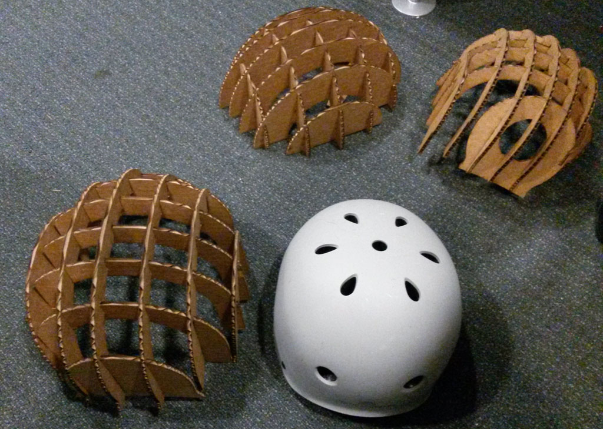
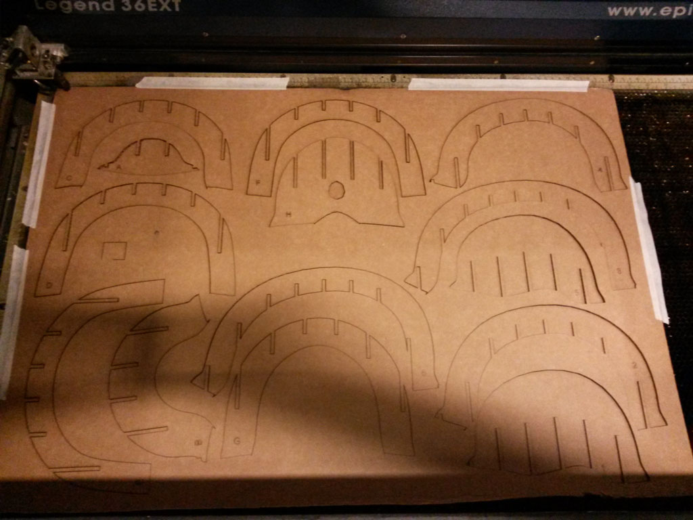
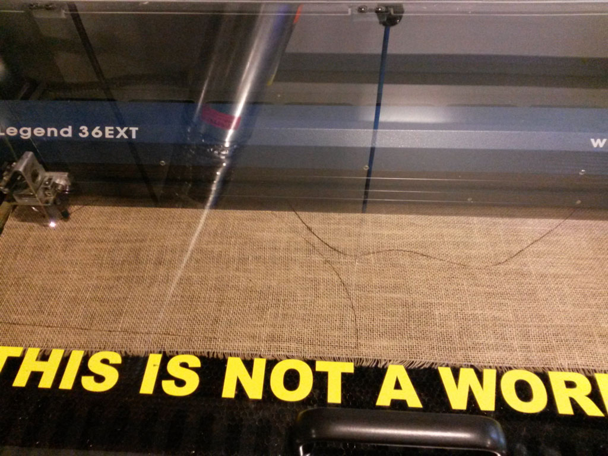

<figure>
	
</figure>

###Idea  
 
When commuting with my bicycle at night, I feel almost invisible, and very unsafe. Also, many time I find myself hoping I could signal the cars and riders around me that I am about to stop or turn.  These reasons are what made me make my smart bike helmet, I also thought that this helmet could be a great integration of all the different thing I learned through the semester and a way to learn some more.  
<figure>
	
	 <figcaption>The bike helmet I designed during the [first week](../week1-computer-aided-design/index.html) when thinking of a final project.</figcaption> 
</figure>

###Design  

 I was inspired by the [cardboard bicycle](http://www.cardboardtech.com/) made 2 years ago in israel. If you can make an entire bike out of cardboard and ride it safely, could you make a eco friendly helmet to fit?  
 I then found out that someone as already thought about this before me - [Kraniums](http://www.kraniums.com/) and they are selling a cardboard helmet that has proved to be safer than some rigid foam helmets.  
 This led me to the decision that the skeleton for my helmet will be laser cut cardboard - it is light, safe, and easy to make.  

 I measured my head and as a first test made an half ellipsoid and cut it out. this worked great, so I used Rhino to design a nicer looking helmet.  
<figure>
	
	 <figcaption>The helmet I designed</figcaption> 
</figure>
I used a great Grasshopper script I found [here](http://www.grasshopper3d.com/forum/topics/a-solid-waffle-for-laser) to create waffle construction.

###Making The Helmet  
I started by laser cutting cardboard.
<figure>
	
	 <figcaption>Laser cutting the helmet parts</figcaption> 
</figure>

After construction the helmet together and trying it out, I decided I need to make a rigid top for it.
<figure class = "third">
	
	
	
	 <figcaption>Trying out the cardboard helmet.</figcaption> 
</figure>

I first decided to try composites. This is explained more on composite week page (added soon).  
Here are some pictures of the process:  
<figure class = "third">
	
	
	
	 <figcaption>Making composites on top of the cardboard helmet</figcaption> 
</figure>
<figure class = "third">
	
	
	
	 <figcaption>composites results</figcaption> 
</figure>  

The result was a really strong helmet (I could even easily stand on it, as seen in the pictures above) but I did not like the look of the burlap, and also wanted a cover that is clear, so I can add the LEDs under it.  
  
I than went on to try vacuum forming.  
For doing vacuum forming, you have to have a mold.  Since I wanted to use thing that were in our inventory, I decided to CNC foam.  The largest tool head in the shop that could mill the foam was 5" long. So I have to cut my model in half, and machine to pieces of 4" foam. (I glued together 2 block of foam using super 77 glue).
<figure class = "third">
	
	
	
	 <figcaption>Machining the foam to make my mold</figcaption> 
</figure>
<figure class = "third">
	
	
	
</figure>  

Vacuum forming is a really quick and simple process, but it's also a kind of art. You heat up a piece o PTEG plastic, laid above your mold,  when it's hot enough, you take to mold up and turn on the vacuum. the hot plastic becomes flexible and get the shape of your mold.
The hardest part is knowing exactly when the plastic is ready. If it's not hot enough it will not be pulled all the way on the mold. If it's too hot, it become too wide, and you get wrinkles and a mess. The difference between not hot enough and too hot is a matter of seconds. John knew it best.
Another thing we've learned is that vacuum forming foam is not the best Idea. The foam gets hot and changes it shape, I also stick to the plastic.
For preventing the sticking, I covered the mold with Gesso and let it dry, I then sprayed a lot of resales on it before every vacuum forming.

<figure class = "third">
	
	
	
	 <figcaption>Vacuum forming the helmet mold.</figcaption> 
</figure>
<figure class = "third">
	
	
	
</figure>  

I did not consider the shrinking of the foam during the vacuum forming. This was a problem since the plastic helmet was too small and could not fit on the cardboard. For the plastic to fit on the cardboard helmet and the helmet to also fit on my head, I had to make it really thin. My original design was 3 cm thick, the this design was 1cm thick, this was much less strong and I would only want to use the thin helmet as a last resource.
Instead, I tried to vacuum form again, this time on a cardboard model, a little bit bigger than the helmet I would really use.  
I used paper mache to cover the helmet from the outside. Since I already used this technique for the composites, I knew the paper with the glue will be strong enough to handle the vacuum forces.
I cut brown paper in pieces, and glued them on top of the helmet using All-purpose glue that I miked with a little bit of water. it's very important that the entire piece will be covered in glue.
<figure>
	
	<figcaption> Cardboard and paper mache vacuum forming mold.</figcaption>
</figure> 
I again sprayed a lot of release on the model.
<figure class="half">
	
	
	<figcaption> Vacuum forming the cardboard mold</figcaption>
</figure> 

I tried the cardboard mold twice, the first time, it was just a little bit to cold. and did not go all the was to the edges of the mold. The second time it was way too hat, I sticked to my model and I had to throw it away. I took the almost perfect one and later used a heat gun to fit it completely on my cardboard base.

<figure class="half">
	
	
	<figcaption> Using heat gun to fit the plastic.</figcaption>
</figure>   
  

###Electronics  

 The electronics part was done in parallel to the making of the helmet itself. I started out by making a small breakout board for the LSM303 - The accelerometer and compass sensor. I thought the having a compass in my helmet can be useful for other cool implementations and wanted to try it out.  
 I used the Application hints from the [LSM303 datasheet](http://www.st.com/web/en/resource/technical/document/datasheet/DM00027543.pdf).  
<figure>
	
	<figcaption> Application hints from the data sheet.</figcaption>
</figure>   
Since we don't have 4.7uF and 0.22uF capacitors in the inventory I used 2 .1uF capacitors in parallel to get .2uF, and 2 10 uF capacitors in series to get 5 uF. I designed the board in Eagle leaving large SMD pads to connect power, GND, SCL,SDA, INT1 and INT2.  
I also added a 3.3V regulator, do no matter what power is connected, the accelerometer always get 3.3V (Analog supply voltage 2.16 V to 3.6 V specified in the datasheet)
<figure>
	
	<figcaption> Eagle schematics</figcaption>
</figure>   
<figure>
	
	<figcaption> the board I sent for milling</figcaption>
</figure> 
<figure>
	
	<figcaption> breakout board with components soldered.</figcaption>
</figure> 
I used Neil's reflow method to solder the tiny accelerometer component.  

I than tested this using a Sparkfun RedBoard (Arduino Uno compatible) and [Adafruit's LSM303 Library](https://github.com/adafruit/Adafruit_LSM303).  
At the first try, nothing printed to the serial port and I was very disappointed. I tested the board using a multimeter and everything seemed fine. One of the TA's suggested that the accelerometer is not soldered to the board correctly. I used to heat gun again and pressed the component the the board really hard this time, from all it's sides.  
This did the trick and this time I got values printing, corresponding the the location and acceleration of the board :).  

I then went on the design the main control board. I knew I would have to use a few Arduino libraries that will probably take a lot of space, so the ATtiny84 with 8 Kbytes flash memory will not be enough.
After some research about different ATMega controllers and ATxmege, I decided to use the ATMeag328P, which was in the inventory, and is also used in Neil's  [hello.arduino.328P board](http://academy.cba.mit.edu/classes/embedded_programming/index.html) that I could use as a reference for designing my board.

As output LEDs I used [Adafruit NeoPixel Digital RGB LED Strip](https://www.adafruit.com/products/1138) which is a strip of RGB LED that are separately addressable controlled by only one digital output pin.
Adafruit website recommends using a large capacitor between VCC and GND for the LEDs, I used the larges SMD capacitor I could find which was 220 uF.
I added connections to SDA and SCL so I could speak to the accelerometer and also used 3 digital pines for 2 capacitive touch surfaces, that will control the turning lights. (one pin for send and 2 pines for receive.) I used 5M resistors between the send and receive pins.
Also added a lithium battery connector and an ON/OFF slider switch. I also added one connection the one Analog pin but I ended up not using this.

<figure>
	
	<figcaption> Eagle schematics</figcaption>
</figure>   
<figure>
	
	<figcaption> the board I sent for milling</figcaption>
</figure> 
<figure>
	
	<figcaption> Soldering the ATMega, (I ruined the first one. Then I first put solder on the copper traces and the refolwed it with the soldering iron one each leg.</figcaption>
</figure> 

